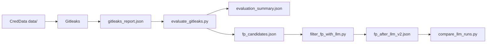
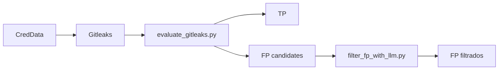
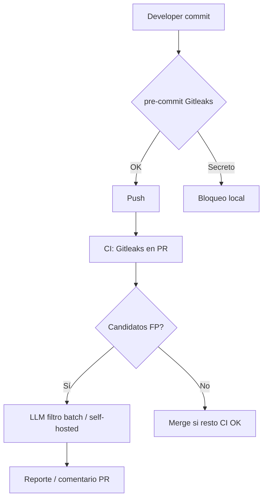

# Trabajo Fin de Máster

## Detección de secretos en código y pipelines mediante reglas y LLM

---

**Autor/a:** Ángela Ramírez Barajas  
**Titulación:** 2ª Ed. Máster en IA Aplicada a la Ciberseguridad (UCAM)  
**Universidad / Centro:** Universidad Católica de Murcia  
**Director/a:** Juanjo Salvador  
**Fecha:** Julio 2026

---

## Resumen

La exposición accidental de credenciales en repositorios de código constituye un riesgo de seguridad recurrente. Las herramientas de detección basadas en reglas —expresiones regulares y análisis de entropía— ofrecen baja latencia e integración sencilla en pipelines DevSecOps, pero generan un volumen elevado de falsos positivos que dificulta su adopción en el día a día del desarrollo.

Este Trabajo Fin de Máster diseña, implementa y evalúa un pipeline híbrido que combina Gitleaks con un modelo de lenguaje grande (LLM) desplegado localmente mediante Ollama (`llama3.1:8b`), orientado exclusivamente a reclasificar candidatos falsos positivos sin alterar los verdaderos positivos detectados por las reglas. La evaluación se realiza sobre el benchmark CredData (Samsung), con scripts reproducibles de métricas y comparación de versiones de prompt.

Los resultados experimentales muestran que la baseline de Gitleaks alcanza una precisión del 85,85 % y un recall del 45,86 % (F1 = 59,79 %) sobre 8.210 hallazgos. Al aplicar el LLM con un prompt que incorpora reglas de contexto —rutas de test, mocks, fixtures y documentación— se filtra correctamente el 99 % de una muestra de 200 falsos positivos, con una precisión híbrida proyectada del 99,97 % y cero regresiones respecto a un prompt genérico (34 % de acierto). El trabajo documenta además la integración en pre-commit y GitHub Actions, un repositorio de demostración y políticas de rotación y ocultación de secretos.

Se concluye que el enfoque híbrido es viable sin fine-tuning ni servicios cloud, aunque el LLM no mejora el recall de la capa de reglas y su evaluación se limita a una muestra parcial de falsos positivos. El código y la configuración del pipeline están disponibles en un repositorio público.

**Palabras clave:** detección de secretos, Gitleaks, LLM, falsos positivos, DevSecOps, CredData, pre-commit.

---

## Abstract

Accidental exposure of credentials in source code repositories remains a persistent security risk. Rule-based detection tools —regular expressions and entropy analysis— offer low latency and straightforward integration into DevSecOps pipelines, but they produce a high volume of false positives that hinders day-to-day developer adoption.

This Master's Thesis designs, implements, and evaluates a hybrid pipeline combining Gitleaks with a locally deployed Large Language Model (LLM) via Ollama (`llama3.1:8b`), focused exclusively on reclassifying false-positive candidates without altering true positives detected by the rule layer. Evaluation is conducted on the CredData benchmark (Samsung), with reproducible metric scripts and prompt version comparison.

Experimental results show that the Gitleaks baseline achieves 85.85% precision and 45.86% recall (F1 = 59.79%) over 8,210 findings. When applying the LLM with a context-aware prompt —encoding rules for test paths, mocks, fixtures, and documentation— 99% of a 200 false-positive sample are correctly filtered, yielding a projected hybrid precision of 99.97%, with zero regressions compared to a generic prompt (34% accuracy). The thesis also documents integration via pre-commit hooks and GitHub Actions, a demonstration repository, and credential rotation and concealment policies.

The hybrid approach is shown to be viable without fine-tuning or cloud APIs, although the LLM does not improve the rule layer's recall and evaluation is limited to a partial false-positive sample. Pipeline code and configuration are publicly available.

**Keywords:** secret detection, Gitleaks, LLM, false positives, DevSecOps, CredData, pre-commit.

---

## Índice

1. [Introducción](#1-introducción)
2. [Estado del arte](#2-estado-del-arte)
3. [Objetivos y hipótesis](#3-objetivos-y-hipótesis)
4. [Metodología](#4-metodología)
5. [Implementación](#5-implementación)
6. [Experimentos y resultados](#6-experimentos-y-resultados)
7. [Integración en pre-commit y CI/CD](#7-integración-en-pre-commit-y-cicd)
8. [Políticas de rotación y ocultación](#8-políticas-de-rotación-y-ocultación)
9. [Discusión y limitaciones](#9-discusión-y-limitaciones)
10. [Conclusiones y trabajo futuro](#10-conclusiones-y-trabajo-futuro)
11. [Bibliografía](#11-bibliografía)
12. [Anexos](#12-anexos)

---

## 1. Introducción

### 1.1 Motivación

La exposición accidental de credenciales (API keys, tokens, contraseñas, claves privadas) en repositorios de código y pipelines de CI/CD constituye un riesgo de seguridad recurrente. Las herramientas de escaneo basadas en reglas (regex, entropía) ofrecen buena cobertura y baja latencia, pero generan un volumen elevado de **falsos positivos** que dificultan su adopción en flujos de desarrollo diarios.

Los modelos de lenguaje (LLM) permiten analizar el **contexto semántico** de un candidato (ruta del archivo, entorno de test, documentación) y distinguir secretos reales de ejemplos, mocks o placeholders.

### 1.2 Problema de investigación

¿Puede una capa LLM aplicada sobre los candidatos generados por un escáner de reglas reducir significativamente los falsos positivos manteniendo la detección de secretos verdaderos, e integrarse de forma práctica en pre-commit y CI/CD?

### 1.3 Alcance

- **Incluido:** pipeline reglas + LLM, evaluación cuantitativa sobre CredData, diseño de integración DevSecOps, políticas de respuesta.
- **Excluido:** entrenamiento/fine-tuning de modelos, procesamiento del corpus CredData completo (1.128 FP), verificación activa de credenciales (estilo TruffleHog verify).

### 1.4 Estructura del documento

El capítulo 2 revisa el estado del arte en detección de secretos: herramientas basadas en reglas, benchmarks etiquetados (CredData, SecretBench) y trabajos recientes que combinan escáneres con LLM. El capítulo 3 define los objetivos, la hipótesis de investigación y los criterios de éxito. Los capítulos 4 y 5 describen la metodología experimental y la implementación del pipeline —scripts, configuración y capas Gitleaks y Ollama—. El capítulo 6 presenta los resultados sobre CredData: baseline de reglas, filtrado LLM (prompts v1 y v2), discusión y un experimento de integridad de datos (detección de envenenamiento en `fp_candidates.json`, §6.6). El capítulo 7 documenta la integración DevSecOps en pre-commit y GitHub Actions, incluida la herramienta empaquetada `secret-triage` publicada en TestPyPI; el capítulo 8 expone las políticas de rotación y ocultación de credenciales, incluidos los secretos en pipelines CI/CD. El capítulo 9 analiza limitaciones y amenazas a la validez; el capítulo 10 recoge las conclusiones y líneas de trabajo futuro. Por último, el capítulo 11 recoge la bibliografía y el capítulo 12 los anexos con comandos de reproducción, ficheros de resultados y capturas.

### 1.5 Alineación con el enunciado del máster

El presente TFM responde al enunciado oficial del Trabajo Fin de Máster:

> *Detección de secretos en código y pipelines. Combinar reglas (expresiones regulares/entropía) con un LLM para reducir falsos positivos al buscar claves y tokens en repositorios e integrarlo en pre-commit y CI/CD. Medir resultados y proponer políticas de rotación y ocultación.*

La tabla siguiente relaciona cada exigencia del enunciado con el contenido y la evidencia aportada en esta memoria:

| Exigencia del enunciado | Realización en el TFM | Capítulo / evidencia |
|-------------------------|----------------------|----------------------|
| Detección de secretos en **código** | Escaneo Gitleaks sobre CredData (repos GitHub reales) y `examples/demo-repo` | 4, 5, 6, 7 |
| Detección en **pipelines** | Workflow GitHub Actions (`secret-scan.yml`); políticas para secretos en CI | 7, 8.5 |
| **Reglas** (regex / entropía) | Gitleaks como capa de detección; baseline cuantificada | 2.1, 5.2, 6.1 |
| **LLM** para reducir **falsos positivos** | Ollama (`llama3.1:8b`) sobre candidatos FP; prompt v2 (99 % acierto en muestra) | 5.3, 6.2, 6.5 |
| Buscar **claves y tokens** en **repositorios** | Evaluación sobre CredData: API keys, PEM, tokens, passwords etiquetados | 4.1, 6 |
| Integración **pre-commit** | `.pre-commit-config.yaml`; demo con commit bloqueado | 7.1, 7.3, Anexo C |
| Integración **CI/CD** | Gitleaks Action en push/PR a `main` | 7.2, 7.4 |
| **Empaquetado reproducible** | CLI `secret-triage` publicado en TestPyPI; verificación `pip install` en Windows | 7.8 |
| **Medir resultados** | TP/FP/recall, precisión híbrida, comparativa v1 vs v2, figuras; detección de envenenamiento P2 | 6, 6.6, `docs/figures/` |
| **Políticas de rotación y ocultación** | Clasificación de hallazgos, rotación, ocultación en vault/CI, gobierno | 8 |

El trabajo cubre de forma explícita las seis dimensiones del enunciado: detección (código + pipeline), enfoque híbrido reglas+LLM, integración operativa (pre-commit/CI), medición experimental y marco de respuesta organizativa ante hallazgos.

---

## 2. Estado del arte

La exposición de credenciales en repositorios de código fuente es un problema persistente y cuantitativamente relevante. Informes del sector documentan millones de secretos expuestos en plataformas como GitHub, con tendencia al alza año tras año (Basak et al., 2023). Las organizaciones han respondido con herramientas de escaneo automatizado, benchmarks etiquetados y, más recientemente, modelos de lenguaje que aportan comprensión contextual. Este capítulo revisa esas líneas de trabajo y sitúa el presente TFM en relación con ellas.

### 2.1 Detección de secretos basada en reglas

Los escáneres basados en reglas constituyen la primera línea de defensa en la práctica DevSecOps. Su principio es combinar **patrones estructurados** (expresiones regulares para formatos conocidos: claves AWS, tokens GitHub, JWT, PEM) con **análisis de entropía** para detectar cadenas aleatorias de alta complejidad que podrían ser secretos genéricos (Meli et al., 2019).

| Herramienta | Enfoque | Ventajas | Limitaciones |
|-------------|---------|----------|--------------|
| **Gitleaks** (Zanev, 2024) | Regex + entropía; modo `protect` para pre-commit | Rápida, offline, integrable en pre-commit y CI | Muchos FP sin contexto semántico; recall limitado en formatos no cubiertos |
| **detect-secrets** (Yelp, 2024) | Plugins por tipo + baseline (`--baseline`) | Buena gestión de histórico y FP conocidos | Requiere tuning manual y mantenimiento de baseline |
| **TruffleHog** (Truffle Security, 2024) | Regex + verificación activa contra APIs | Alta confianza si la credencial sigue activa | Lento, depende de red; riesgo ético al verificar secretos ajenos |
| **shhgit** | Escaneo en tiempo real de GitHub | Útil para monitorización pública | Menor adopción en pipelines privados |
| **CredSweeper** (Samsung, 2022) | ML + reglas; entrenado con CredData | Mejor equilibrio precisión/recall en benchmark oficial | Requiere modelo entrenado; mayor complejidad de despliegue |

Gitleaks es ampliamente adoptado por su simplicidad y su integración nativa con Git (hook pre-commit, GitHub Actions). En el benchmark publicado por Samsung sobre CredData (abril 2022), Gitleaks obtuvo precisión del 52,6 % y recall del 24,4 % (F1 = 33,4 %), cifras inferiores a herramientas ML como CredSweeper pero con la ventaja de no requerir entrenamiento ni infraestructura adicional (Yun et al., 2021).

Las guías OWASP recomiendan complementar la **prevención** (gestores de secretos, variables de entorno, nunca hardcodear) con **detección automatizada** en el ciclo de vida del software: pre-commit hooks para interceptar secretos antes del push y escaneo en CI/CD como segunda barrera (OWASP, 2024a, 2024b). Este enfoque *shift-left* reduce la ventana de exposición pero no elimina los falsos positivos inherentes a las reglas.

**Limitación común:** las herramientas basadas en reglas tratan cada coincidencia de forma aislada. Un token con formato válido en un archivo de test, un mock o un bloque de documentación genera la misma alerta que una credencial de producción, lo que produce fatiga de alertas y resistencia de los equipos de desarrollo.

### 2.2 Datasets de evaluación

La evaluación rigurosa de detectores de secretos requiere datasets con **ground truth manual**. Sin benchmarks etiquetados, es imposible comparar de forma reproducible precisión, recall y tasa de FP entre herramientas o enfoques.

#### CredData (Samsung)

CredData (Yun et al., 2021) es el benchmark utilizado en este TFM. Consiste en líneas de código extraídas de repositorios open source de GitHub, etiquetadas manualmente como credencial real (T), falso positivo (F) o no aplicable (X). Incluye metadatos de categoría (API keys, passwords, PEM, tokens, etc.) y cubre ~20 lenguajes y formatos de archivo. El repositorio oficial proporciona scripts de benchmark (`python -m benchmark --scanner gitleaks`) y resultados comparativos de ocho herramientas.

| Atributo | CredData | Este TFM (generación local) |
|----------|----------|----------------------------|
| Fuente | GitHub open source | Mismo proceso (`download_data.py`) |
| Líneas etiquetadas | ~66.898 (meta local) | 66.898 |
| Secretos reales (T) | ~15.104 | 15.104 |
| Archivos en `data/` | ~11.408 (oficial) | 11.393 |

CredData fue elegido por ser **público, reproducible y ampliamente citado**, y por incluir Gitleaks en su benchmark oficial. A diferencia de SecretBench, no requiere acceso a Google BigQuery y su tamaño es manejable en un entorno local con WSL.

#### SecretBench

SecretBench (Basak et al., 2023) aporta 97.479 candidatos extraídos de 818 repositorios GitHub, de los cuales 15.084 están verificados como secretos reales. Cubre 49 lenguajes y 311 tipos de archivo. Cada entrada incluye contexto de commit, ruta y metadatos de línea. Está alojado en Google BigQuery y Cloud Storage, lo que facilita consultas a gran escala pero añade fricción para un TFM con plazo limitado.

SecretBench ha impulsado trabajos recientes con LLM (Rahman et al., 2025) y constituye la referencia dominante para evaluación a escala de detectores híbridos.

#### Otros datasets

- **FPSecretBench / variantes ampliadas:** corpus de mayor volumen orientado específicamente a falsos positivos; útil para entrenar clasificadores pero con requisitos de almacenamiento elevados (~1 TB en algunas versiones), inviables en el plazo del presente trabajo.
- **Repositorios sintéticos o CTF:** útiles para pruebas unitarias pero sin ground truth representativo de código real.

### 2.3 Uso de LLM en detección de secretos

La literatura reciente muestra una convergencia hacia enfoques **híbridos**: una capa de extracción (regex, reglas o escáner existente) genera candidatos, y un modelo — clásico o LLM — clasifica si el candidato es un secreto real en función del contexto.

#### Enfoques con fine-tuning y embeddings

Biringa y Kul (2025) proponen representar credenciales con embeddings de BERT y GPT-2, alimentando un clasificador profundo (GPT2-MLP) entrenado sobre CredData. Reportan una mejora del 13 % en F1 respecto al estado del arte previo, con F1 agregado de 0,973 en validación cruzada. Su motivación coincide con la de este TFM: los modelos contextuales discriminan mejor que las reglas puras cuando el formato del valor es ambiguo. Sin embargo, su enfoque requiere **entrenamiento offline** y despliegue del clasificador en CI, mientras que este TFM explora **inferencia con prompt** sin fine-tuning.

CredSweeper (Samsung, 2022) representa la línea ML clásica sobre el mismo benchmark: modelo entrenado con características de código y texto, integrado en el ecosistema Samsung. Obtiene el mejor F1 en el benchmark oficial de CredData (0,859), pero exige pipeline de entrenamiento y actualización del modelo.

#### Enfoques híbridos regex + LLM generativo

Rahman et al. (2025) presentan el trabajo más cercano al presente TFM. Combinan extracción de candidatos por regex con clasificación mediante LLM sobre SecretBench. Evalúan LLaMA-3.1 8B, Mistral-7B y otros modelos con distintas estrategias de prompt y fine-tuning (LoRA). Su mejor resultado — LLaMA-3.1 8B fine-tuned — alcanza F1 = 0,985 en clasificación binaria, superando ampliamente las baselines solo-regex. Concluyen que los LLM open source permiten despliegue local sin APIs comerciales.

**Diferencias respecto a este TFM:**

| Aspecto | Rahman et al. (2025) | Este TFM |
|---------|----------------------|----------|
| Dataset | SecretBench | CredData |
| Escáner base | Regex propio | Gitleaks |
| LLM | Fine-tuning (LoRA) + prompt | Solo inferencia (Ollama, prompt v1/v2) |
| Modelo | LLaMA-3.1 8B fine-tuned | LLaMA-3.1 8B sin fine-tuning |
| Objetivo | Maximizar F1 global | Reducir FP de Gitleaks manteniendo TP |
| Integración DevSecOps | Propuesta conceptual | Pre-commit + GitHub Actions implementados |

Este TFM demuestra que **prompt engineering contextual** (v2: reglas de ruta test/mock/fixture) puede alcanzar 99 % de acierto en filtrado de FP sin fine-tuning, con el trade-off de no mejorar el recall de la capa de reglas.

#### Prompting vs. fine-tuning

La elección de inferencia zero-shot / few-shot con reglas explícitas en el prompt responde a restricciones prácticas del TFM: plazo limitado, sin GPU dedicada para entrenamiento, y necesidad de iterar rápidamente (comparativa v1 vs v2). La literatura sugiere que el fine-tuning supera al prompting puro en métricas globales (Rahman et al., 2025), pero el prompting estructurado puede ser suficiente para la tarea acotada de **reclasificar FP ya detectados**, que es donde se concentra el coste operativo de Gitleaks.

### 2.4 Brecha identificada

Tras la revisión del estado del arte, se identifican las siguientes lagunas que este TFM aborda:

1. **Evaluación reproducible local:** Rahman et al. (2025) y Biringa y Kul (2025) reportan resultados sobre infraestructura y datasets que requieren fine-tuning o acceso a BigQuery. Falta documentación de un pipeline **100 % local** (Ollama + Gitleaks + CredData) medible con scripts abiertos.

2. **Métrica orientada a operaciones:** Los benchmarks oficiales reportan F1 global sobre líneas etiquetadas. En DevSecOps, el problema inmediato de Gitleaks no es solo el recall sino el **volumen de FP** que bloquea o distrae a desarrolladores. Este TFM mide explícitamente la reducción de FP y la precisión híbrida proyectada.

3. **Iteración de prompt documentada:** No existen, hasta donde alcanza esta revisión, comparativas publicadas de versiones de prompt (genérico vs. reglas de contexto) sobre los mismos candidatos FP de Gitleaks en CredData.

4. **Integración end-to-end:** Los trabajos académicos se centran en métricas de laboratorio. Este TFM cierra el ciclo con pre-commit, GitHub Actions y políticas de respuesta (capítulos 7 y 8).

La brecha no es «usar LLM para secretos» — ya demostrado — sino **cuantificar el aporte incremental del LLM como filtro de FP sobre Gitleaks en CredData, sin fine-tuning, con despliegue reproducible en DevSecOps**.

---

## 3. Objetivos y hipótesis

### 3.1 Objetivo general

Diseñar, implementar y evaluar un pipeline híbrido de detección de secretos que combine Gitleaks con un LLM local para reducir falsos positivos, e integrarlo en flujos pre-commit y CI/CD con políticas de respuesta.

### 3.2 Objetivos específicos

1. Establecer una baseline con Gitleaks sobre CredData.
2. Implementar un filtro LLM sobre candidatos FP.
3. Medir precisión, recall y tasa de FP antes y después del filtrado.
4. Iterar el prompt del LLM y comparar versiones (v1 vs v2).
5. Proponer integración en pre-commit y GitHub Actions.
6. Documentar políticas de rotación y ocultación.

### 3.3 Hipótesis

> **H1:** Una capa LLM sobre candidatos de Gitleaks reduce los falsos positivos en al menos un 30 % respecto a la baseline de reglas, en una muestra etiquetada de CredData.

**Resultado:** Confirmada. En muestra de 200 FP, la tasa de filtrado correcto pasó del 34 % (v1) al 99 % (v2).

---

## 4. Metodología

### 4.1 Dataset

| Atributo | Valor |
|----------|-------|
| Nombre | CredData (Samsung) |
| Fuente | https://github.com/Samsung/CredData |
| Generación local | `download_data.py` (entorno Linux/WSL) |
| Archivos en `data/` | 11.393 |
| Líneas etiquetadas en `meta/` | 66.898 |
| Secretos reales etiquetados (T) | 15.104 |

El dataset **no se incluye en el repositorio** del TFM por tamaño; se documenta el proceso de generación.

### 4.2 Pipeline experimental



### 4.3 Herramientas y versiones

| Componente | Versión / detalle |
|------------|-------------------|
| Gitleaks | 8.30.1 (local); hook pre-commit rev. v8.24.2 |
| Python | 3.10+ |
| LLM | Ollama, modelo `llama3.1:8b` |
| SO evaluación | Windows 10 + WSL (generación dataset) |

### 4.4 Métricas

| Métrica | Definición |
|---------|------------|
| **TP** | Gitleaks alerta y GroundTruth = T |
| **FP** | Gitleaks alerta y GroundTruth = F/X |
| **FN** | GroundTruth = T y Gitleaks no alerta |
| **Precisión** | TP / (TP + FP) |
| **Recall** | TP detectados / total T |
| **F1** | Media armónica de precisión y recall |
| **Tasa filtrado FP (LLM)** | FP correctamente reclasificados / total FP evaluados |

### 4.5 Diseño experimental

1. **Fase A:** Escaneo Gitleaks completo sobre `data/`.
2. **Fase B:** Cruce con `meta/*.csv` → baseline.
3. **Fase C:** Filtrado LLM sobre muestra de FP (N=200).
4. **Fase D:** Comparativa prompt v1 vs v2.

---

## 5. Implementación

### 5.1 Estructura del proyecto

Repositorio: `secret-scan-tfm` (https://github.com/aramirezbarajas/secret-scan-tfm)

```
secret-scan-tfm/
├── .pre-commit-config.yaml
├── .github/workflows/secret-scan.yml
├── config.yaml
├── examples/demo-repo/    # Demo pre-commit + allowlist Gitleaks
├── scripts/
│   ├── evaluate_gitleaks.py
│   ├── filter_fp_with_llm.py
│   ├── compare_llm_runs.py
│   └── backup_llm_run.py
├── datasets/creddata/     # local, no versionado
├── results/               # local, no versionado
└── docs/
    └── MEMORIA.md
```

### 5.2 Capa de reglas (Gitleaks)

```bash
gitleaks detect --source ./datasets/creddata/data \
  --report-format json --report-path ./results/gitleaks_report.json --no-git
```

### 5.3 Capa LLM (Ollama)

- API: `POST /api/chat`
- Prompt v2: reglas explícitas para rutas `test/`, `mock/`, `fixture/`, `docs/`, valores `MOCK`, placeholders, OAuth de desarrollo.
- Parámetros: `temperature=0`, timeout 300 s, contexto truncado para líneas largas.

### 5.4 Scripts de evaluación

Breve descripción de `evaluate_gitleaks.py`, `filter_fp_with_llm.py` y `compare_llm_runs.py`. [Ampliar si el tribunal lo requiere.]

---

## 6. Experimentos y resultados

### 6.1 Baseline: solo Gitleaks

| Métrica | Valor |
|---------|-------|
| Volumen escaneado | ~1,02 GB |
| Tiempo de escaneo | 56,8 s |
| Hallazgos totales | 8.210 |
| TP (sobre etiquetados) | 6.845 |
| FP (sobre etiquetados) | 1.128 |
| Precisión (hallazgos etiquetados) | **85,85 %** |
| Recall (filas T) | **45,86 %** |
| F1 | **59,79 %** |
| Tasa FP / hallazgos etiquetados | 14,15 % |

**Interpretación:** Gitleaks detecta muchos secretos reales pero con recall moderado; el volumen de FP dificulta el triaje manual.

### 6.2 Filtrado LLM — muestra de 200 FP

#### Prompt v1 (baseline LLM)

| Métrica | Valor |
|---------|-------|
| FP evaluados | 200 |
| FP filtrados correctamente | 68 |
| Tasa acierto en FP | **34 %** |
| Precisión híbrida proyectada | 98,11 % |

#### Prompt v2 (reglas test/mock/fixture)

| Métrica | Valor |
|---------|-------|
| FP evaluados | 200 |
| FP filtrados correctamente | 198 |
| Tasa acierto en FP | **99 %** |
| Precisión híbrida proyectada | **99,97 %** |

#### Comparativa v1 vs v2 (199 candidatos en común)

| Resultado | Cantidad |
|-----------|----------|
| Corregidos (v1 mal → v2 bien) | **130** |
| Empeorados (v1 bien → v2 mal) | **0** |
| Iguales correctos | 68 |
| Iguales incorrectos | **1** |

### 6.3 Caso residual (único fallo persistente en v2)

| Campo | Valor |
|-------|-------|
| Archivo | `data/255bae6f/model/app/0f82c217.rb:32` |
| Tipo | `private-key` (PEM en documentación inline) |
| Contexto | Bloque `description <<-MD` con JSON de ejemplo de Google Service Account; clave truncada (`...`), IDs `123123` |
| Motivo del fallo | Ruta `model/app/` no activa reglas de test; formato PEM parece credencial real |

### 6.4 Gráficos y tablas

Figuras y tablas exportables: ejecutar `python scripts/generate_thesis_figures.py` (ver `docs/FIGURAS.md`).

| Figura | Archivo | Descripción |
|--------|---------|-------------|
| 6.1 | `docs/figures/fig01_pipeline_hibrido.png` | Pipeline híbrido CredData → Gitleaks → LLM |
| 6.2 | `docs/figures/fig02_precision_comparativa.png` | Barras: precisión baseline vs v1 vs v2 |
| 6.3 | `docs/figures/fig03_fp_filtrados_llm.png` | FP filtrados correctamente (68 vs 198) |
| 6.4 | `docs/figures/fig04_comparativa_v1_v2.png` | Comparativa v1 vs v2 (corregidos, empeorados) |
| 6.5 | `docs/figures/fig05_precision_recall.png` | Precision vs recall (recall sin cambio) |

Tablas listas para copiar: `docs/figures/tabla_resumen.md` (tablas 6.1–6.4).

Diagrama Mermaid (alternativa editable):



### 6.5 Discusión de resultados

Los experimentos sobre CredData permiten responder a la pregunta de investigación planteada en el capítulo 1: el LLM **sí reduce de forma significativa los falsos positivos** generados por Gitleaks, pero su utilidad depende del diseño del prompt y del punto del pipeline en el que se aplica. A continuación se analizan los resultados por capas.

#### 6.5.1 Rendimiento de la baseline (solo reglas)

Gitleaks obtiene una **precisión del 85,85 %** sobre hallazgos en líneas etiquetadas (6.845 TP frente a 1.128 FP), lo que confirma que la herramienta es útil como primera línea de detección: la gran mayoría de alertas en líneas con ground truth corresponden a secretos reales. Sin embargo, el **recall del 45,86 %** revela la otra cara del enfoque basado en reglas: de 15.104 filas etiquetadas como secretos en `meta/`, Gitleaks solo alerta en 6.927 (8.177 FN). El F1 resultante (59,79 %) refleja un equilibrio mediocre entre ambas métricas.

Este recall moderado no es sorprendente en un corpus diverso como CredData. El análisis de FN muestra categorías poco cubiertas por las reglas por defecto de Gitleaks: credenciales en URLs, nonces, formatos propietarios o secretos en contextos que no activan los patrones regex ni los umbrales de entropía configurados. Las herramientas de reglas priorizan **velocidad y cobertura de formatos conocidos** (AWS, GitHub, PEM, JWT) frente a la exhaustividad sobre cualquier tipo de credencial. En un escenario de producción, esto implica que el pipeline híbrido **no sustituye** a Gitleaks sino que lo complementa: la capa de reglas sigue siendo necesaria para la detección inicial, y el LLM actúa sobre sus excesos, no sobre sus omisiones.

Por otro lado, 1.128 FP en 7.973 hallazgos etiquetados (14,15 %) representan un volumen de triaje manual elevado en un repositorio real. Aunque la precisión sea aceptable en términos porcentuales, en términos absolutos más de mil alertas falsas dificultan la adopción en pre-commit y CI, donde el desarrollador espera feedback accionable y de baja fricción.

#### 6.5.2 Aportación del LLM: de v1 a v2

La primera versión del prompt (v1) alcanza solo un **34 % de acierto** al reclasificar FP conocidos (68 de 200). Con v1, la precisión híbrida proyectada sube del 85,9 % al 98,1 %, pero el modelo sigue marcando como secretos reales muchos candidatos que son fixtures de test, mocks o documentación. El prompt genérico («decide si es secreto real o falso positivo») delega demasiado en la apariencia del valor: un token con formato válido, un bloque PEM o una cadena de alta entropía tienden a clasificarse como auténticos aunque el contexto indique lo contrario.

El prompt v2 incorpora **reglas explícitas de contexto** alineadas con los patrones observados en CredData: segmentos de ruta (`/test/`, `/fixtures/`, `/docs/`), prefijos `MOCK_`, valores placeholder y configuración de desarrollo. El salto a **99 % de acierto** (198/200 FP filtrados correctamente) y **cero regresiones** respecto a v1 (130 correcciones, 0 empeoramientos) demuestra que la mejora proviene del *prompt engineering* estructurado, no de un cambio de modelo. Se utilizó el mismo `llama3.1:8b` con `temperature=0` en ambas versiones.

Este resultado tiene una implicación práctica: el coste marginal del LLM en el pipeline no está en la inferencia (Ollama local, sin API cloud), sino en **mantener y evolucionar las reglas semánticas** del prompt a medida que aparecen nuevos patrones de FP. La comparativa v1→v2 sugiere que invertir esfuerzo en catalogar contextos de FP (rutas, convenciones de nombres, tipos de archivo) aporta más que aumentar el tamaño del modelo o procesar más candidatos con un prompt pobre.

#### 6.5.3 El caso residual y los límites del enfoque contextual

El único fallo persistente en v2 (`data/255bae6f/model/app/0f82c217.rb:32`) ilustra un límite claro del filtrado por contexto: un bloque PEM embebido en documentación inline (`description <<-MD`) dentro de una ruta de aplicación (`model/app/`) sin segmentos de test. Para el LLM, el formato PEM prevalece sobre las señales débiles de ejemplo (IDs `123123`, clave truncada con `...`). Este caso encaja en la categoría de FP que las reglas v2 no cubren y que requeriría una v3 con reglas para heredocs, bloques de documentación en código de producción o detección de PEM parcial/truncado. Se decidió no implementar v3 dado el rendimiento ya alto y el plazo del TFM.

La muestra evaluada (200 de 1.128 FP, ~17,7 %) limita la generalización estadística. No obstante, la muestra es representativa en el sentido de que los FP de CredData se concentran en patrones repetitivos (tests, mocks, docs), precisamente los que v2 ataca. La precisión híbrida proyectada del 99,97 % asume que los TP de Gitleaks permanecen inalterados (el LLM solo procesa la rama FP) y que el comportamiento sobre el 82,3 % restante de FP es similar; esta extrapolación debe interpretarse como **cota optimista** hasta validar con muestreo estratificado o procesamiento completo.

#### 6.5.4 Trade-off latencia–precisión y encaje en DevSecOps

El escaneo de Gitleaks sobre ~1,02 GB de CredData completó en **56,8 s**, lo que lo hace viable en CI y pre-commit. En contraste, el filtrado LLM a ~5–15 s por candidato implicaría **horas** para los 1.128 FP completos y resulta inviable en cada commit. La arquitectura adoptada (cap. 7) separa responsabilidades: Gitleaks en pre-commit y CI para bloqueo rápido; LLM en análisis batch o, en entornos con runner self-hosted, para triaje de alertas nuevas en PRs.

La hipótesis H1 (>30 % de reducción de FP) queda **confirmada con margen amplio**: v2 reduce un 99 % de los FP evaluados. El pipeline híbrido mejora la **precisión operativa** sin sacrificar los TP detectados por Gitleaks, pero no resuelve el **recall bajo** de la capa de reglas. Un sistema de producción completo combinaría este enfoque con ampliación de reglas Gitleaks, herramientas complementarias (`detect-secrets`, verificación activa tipo TruffleHog) y el filtrado LLM para reducir la fatiga de alertas en los casos donde las reglas son demasiado sensibles.

#### 6.5.5 Síntesis

| Dimensión | Solo Gitleaks | Gitleaks + LLM v2 |
|-----------|---------------|-------------------|
| Precisión (hallazgos etiquetados) | 85,85 % | 99,97 % (proyectada) |
| Recall (filas T) | 45,86 % | 45,86 % (sin cambio) |
| Viabilidad en pre-commit | Alta | Solo capa de reglas |
| Dependencia del contexto | Ninguna | Alta (prompt) |
| Coste computacional | Bajo | Medio-alto (batch) |

En conjunto, los resultados validan el enfoque híbrido propuesto: las reglas aportan cobertura y velocidad; el LLM aporta discriminación semántica donde las reglas son demasiado conservadoras. La principal lección del TFM es que **el diseño del prompt contextual es el factor crítico**, más que la mera adición de un modelo de lenguaje al pipeline.

### 6.6 Integridad de datos y detección de envenenamiento (experimento P2)

El pipeline híbrido no solo depende de Gitleaks y del LLM: también **confía en artefactos intermedios** —en particular `results/fp_candidates.json`— que alimentan el filtrado batch. Si un atacante o un insider altera ese fichero (inyecta filas, cambia etiquetas `ground_truth` o duplica entradas), las métricas de evaluación y las decisiones de triaje pueden distorsionarse sin que cambie el código del escáner. Este apartado extiende el TFM hacia la **detección de envenenamiento de datos** (data poisoning) en esa capa, reutilizando el mismo repositorio y CredData.

#### 6.6.1 Pregunta y amenaza

**Pregunta complementaria:** ¿pueden mecanismos ligeros (hash de manifiesto, subconjunto dorado y deriva estadística) detectar alteraciones en `fp_candidates.json` antes de que afecten al LLM o a los informes?

**Vector P2 modelado:** manipulación del export de falsos positivos tras `evaluate_gitleaks.py`. Escenario: compromiso del almacén de resultados o supply-chain interna antes del job de triaje LLM.

#### 6.6.2 Implementación

Scripts en `scripts/` (repositorio GitHub):

| Script | Función |
|--------|---------|
| `build_trust_baseline.py` | Genera manifiesto `results/trust_baseline.json` (SHA-256, recuento, distribución de etiquetas, hash del golden set) |
| `inject_data_poison.py` | Simula ataque P2: modos `inject_rows`, `flip_labels`, `inflate` |
| `detect_data_poison.py` | Ejecuta detectores D1–D5 y emite `results/poison_detection_report.json` |

**Conjunto dorado:** `data/golden_fp_sample.json` — siete huellas `file:line` fijas (incluye casos MOCK y rutas `test/`, alineados con el Anexo D).

**Detectores:**

| ID | Nombre | Criterio de alerta |
|----|--------|-------------------|
| D1 | Integridad (hash) | SHA-256 del fichero ≠ manifiesto |
| D2 | Golden subset | Campos críticos del subconjunto dorado alterados o claves ausentes |
| D3 | Deriva de recuento | Número de filas ≠ 1.128 esperadas |
| D4 | Deriva PSI | Population Stability Index sobre `ground_truth` > 0,2 |
| D5 | Marcadores sintéticos | Solo laboratorio (`_poison_*`, rutas `poison_demo`) |

#### 6.6.3 Diseño experimental

Matriz ejecutada sobre la baseline de 1.128 FP (CredData). Semilla reproducible: 42. Detalle completo en `docs/POISON_P2_RESULTADOS.md`.

| ID | Ataque | % veneno | Filas afectadas |
|----|--------|----------|-----------------|
| A | Limpio (control) | 0 % | 0 |
| B | `inject_rows` | 5 % | +56 filas sintéticas (`ground_truth=T`) |
| C | `flip_labels` | 5 % | 56 etiquetas F/X → T |
| D | `flip_labels` | 30 % | 338 etiquetas volteadas |
| F | `flip_labels` | 1 % | 11 etiquetas volteadas |

#### 6.6.4 Resultados

**Tabla 6.6 — Detección por modo de ataque P2**

| ID | Ataque | D1 hash | D2 golden | D3 recuento | D4 PSI | ¿Detectado? |
|----|--------|---------|-----------|-------------|--------|-------------|
| A | Limpio | OK | OK | OK | OK (0,00) | No |
| B | `inject_rows` 5 % | ALERTA | OK | ALERTA (+56) | ALERTA (0,51) | **Sí** |
| C | `flip_labels` 5 % | ALERTA | OK | OK | ALERTA (0,54) | **Sí** |
| D | `flip_labels` 30 % | ALERTA | ALERTA | OK | ALERTA (3,89) | **Sí** |
| F | `flip_labels` 1 % | ALERTA | OK | OK | OK (0,09) | **Parcial** |

**Interpretación:**

1. **`flip_labels` es más sigiloso que `inject_rows`:** el recuento no cambia (D3 en OK), simulando un atacante que altera etiquetas sin modificar el volumen del dataset.
2. **D4 (PSI) detecta envenenamiento ≥5 %** en la distribución de `ground_truth`; con **1 %** no supera el umbral 0,2.
3. **D1 (hash)** alerta siempre que exista manifiesto previo y el fichero haya cambiado — única garantía robusta en ataques muy sutiles (F).
4. **D2 (golden)** alerta cuando el ataque toca claves del subconjunto dorado (caso D, 30 %).
5. La combinación **hash + golden + PSI** supera la comprobación ingenua de «¿es el mismo fichero cada día?»: los datos legítimos pueden cambiar por nuevas ejecuciones; lo relevante es **coherencia con manifiesto versionado y comportamiento del golden set**.

#### 6.6.5 Relación con el pipeline y políticas

| Componente del TFM | Implicación si hay envenenamiento P2 |
|--------------------|--------------------------------------|
| `evaluate_gitleaks.py` | Métricas TP/FP/recall falsas si las etiquetas o filas están corruptas |
| `filter_fp_with_llm.py` | Candidatos alterados pueden clasificarse mal (FP→keep o TP→dismiss) |
| `secret-triage` | Mismo riesgo sobre informes JSON de Gitleaks |
| Cap. 8 (políticas) | Respuesta: congelar dataset, restaurar manifiesto, rollback, auditoría de accesos |

**Respuesta operativa recomendada** (alineada con cap. 8): versionar manifiestos de integridad junto a releases del pipeline; ejecutar `detect_data_poison.py` antes de jobs LLM batch; documentar en PR cualquier cambio en `fp_candidates.json` (análogo al gobierno de allowlists).

#### 6.6.6 Limitaciones del experimento P2

- Solo se evalúa el vector P2 (candidatos FP), no el envenenamiento de `meta/` (P1) ni del prompt (P3).
- El golden set actual tiene siete claves; ampliarlo aumentaría sensibilidad de D2.
- D5 depende de marcadores de laboratorio; en producción la detección recae en D1+D2+D4.
- No se midió impacto causal en métricas híbridas tras envenenar y ejecutar el LLM (línea futura).

---

## 7. Integración en pre-commit y CI/CD

Este capítulo documenta la implementación real incluida en el repositorio del TFM: un **repositorio de demostración** (`examples/demo-repo/`), hooks **pre-commit** con Gitleaks y un workflow de **GitHub Actions** para escaneo en CI.

### 7.1 Arquitectura de capas

| Capa | Cuándo | Herramienta | Latencia | Rol |
|------|--------|-------------|----------|-----|
| **Local (pre-commit)** | Antes de cada `git commit` | Gitleaks `protect --staged` | < 1 s en repos pequeños | Bloquear secretos antes del push |
| **CI (GitHub Actions)** | Push y pull request | Gitleaks Action | ~10–30 s | Segunda línea de defensa; historial completo |
| **Batch / análisis** | Experimento / triaje FP | `filter_fp_with_llm.py` + Ollama | ~5–15 s/candidato | Reducir falsos positivos; no viable en cada commit |

**Decisión de diseño:** el LLM no se ejecuta en pre-commit ni en runners públicos de GitHub (requiere Ollama local y latencia elevada). El valor del pipeline híbrido se demuestra en el experimento con CredData (cap. 6) y puede desplegarse en CI **self-hosted** si se dispone de GPU/CPU y Ollama.

### 7.2 Repositorio de demostración (`examples/demo-repo/`)

Estructura implementada:

```
examples/demo-repo/
├── app/                    # Código sin secretos hardcodeados (os.environ)
├── tests/fixtures/         # Tokens MOCK_* (allowlist documentada)
├── leaks/                  # Plantilla para probar bloqueo local
├── .gitleaks.toml          # Allowlist de fixtures y docs
├── .pre-commit-config.yaml # Hook Gitleaks (uso standalone)
└── README.md
```

El código de aplicación carga credenciales desde variables de entorno (`app/config.py`), alineado con las políticas del cap. 8. Los fixtures de test usan prefijos `MOCK_` y rutas bajo `tests/fixtures/`, excluidas en `.gitleaks.toml` con justificación en PR.

**Uso standalone** (taller o capturas para la memoria):

```bash
cd examples/demo-repo
git init
pip install pre-commit
pre-commit install
git add .
pre-commit run gitleaks --all-files   # debe pasar
```

**Probar bloqueo de commit** (ver `leaks/README.md`):

```bash
cp leaks/intentional-leak.env.template leaks/demo-block-me.env
git add leaks/demo-block-me.env
git commit -m "test: intento de filtrar secreto"
# Gitleaks aborta el commit y muestra archivo + línea
```

El archivo `demo-block-me.env` está en `.gitignore`; nunca debe subirse al repositorio remoto.

### 7.3 Pre-commit en el repositorio principal

En la raíz de `secret-scan-tfm` se añadió `.pre-commit-config.yaml`:

```yaml
repos:
  - repo: https://github.com/gitleaks/gitleaks
    rev: v8.24.2
    hooks:
      - id: gitleaks
        args: [--config=examples/demo-repo/.gitleaks.toml]
```

Instalación y verificación:

```bash
pip install pre-commit
pre-commit install
pre-commit run gitleaks --all-files
```

Salida observada en entorno de desarrollo (Windows 10, Gitleaks 8.30.1): **Passed** sobre el código versionado del TFM.

El hook invoca `gitleaks protect` sobre los cambios **staged**, equivalente a la recomendación oficial de Gitleaks. Para saltar el hook en emergencia documentada: `SKIP=gitleaks git commit -m "..."` (desaconsejado en producción; ver cap. 8.4).

### 7.4 CI/CD — GitHub Actions

Workflow `.github/workflows/secret-scan.yml`:

```yaml
name: Secret scan
on:
  push:
    branches: [main, master]
  pull_request:

jobs:
  gitleaks:
    runs-on: ubuntu-latest
    steps:
      - uses: actions/checkout@v4
        with:
          fetch-depth: 0
      - uses: gitleaks/gitleaks-action@v2
        env:
          GITHUB_TOKEN: ${{ secrets.GITHUB_TOKEN }}
          GITLEAKS_CONFIG: examples/demo-repo/.gitleaks.toml
```

`fetch-depth: 0` permite escanear el historial Git en PRs. La variable `GITLEAKS_CONFIG` reutiliza la misma allowlist que pre-commit, manteniendo coherencia entre local y CI.

**Extensión futura (CI self-hosted):** tras el job de Gitleaks, exportar candidatos FP nuevos y ejecutar `filter_fp_with_llm.py`; publicar un comentario en el PR con los reclasificados. No implementado en GitHub-hosted por dependencia de Ollama.

### 7.5 Flujo operativo



### 7.6 Allowlist y gobierno

El fichero `examples/demo-repo/.gitleaks.toml` extiende la configuración por defecto (`[extend] useDefault = true`) y define rutas permitidas:

- `tests/fixtures/` — datos de prueba con prefijo `MOCK_`
- `docs/`, plantillas `leaks/*.template`
- `.env.example` — placeholders sin valor real

Toda ampliación de la allowlist debe documentarse en el PR (cap. 8.4). Los hallazgos en código de producción (`app/`) no tienen excepción.

### 7.7 Capturas sugeridas para el PDF

- Terminal: `pre-commit run gitleaks --all-files` → Passed
- Terminal: commit bloqueado tras `demo-block-me.env`
- GitHub Actions: job *Gitleaks* en verde en un push de prueba
- TestPyPI: página del proyecto `secret-triage` v0.1.2 (ver 7.8)
- Terminal: `pip install` desde TestPyPI + `secret-triage --help` + informe `report` (ver 7.8)

### 7.8 Herramienta derivada `secret-triage` y publicación en TestPyPI

Como extensión del pipeline experimental del TFM, se empaquetó la lógica de triaje LLM en un **CLI instalable** (`secret-triage/`), reutilizando el prompt v2 validado en el capítulo 6. El objetivo es demostrar que el enfoque híbrido no queda limitado a scripts ad hoc del repositorio, sino que puede distribuirse como artefacto reproducible para entornos DevSecOps con Ollama local.

#### Arquitectura y comandos

| Comando | Función |
|---------|---------|
| `secret-triage init` | Crea `secret-triage.yaml` (configuración Ollama y contexto) |
| `secret-triage filter` | Clasifica hallazgos Gitleaks (`keep` / `dismiss`) |
| `secret-triage report` | Genera informe Markdown desde `triaged.json` |
| `secret-triage sarif` | Exporta SARIF 2.1.0 (solo hallazgos `action=keep`) |

El flujo operativo es: **Gitleaks** → JSON → **secret-triage filter** (Ollama) → informe Markdown o SARIF. No sustituye a Gitleaks; post-procesa su salida para reducir falsos positivos en batch o en runners self-hosted.

#### Publicación en TestPyPI

El paquete se publicó en el índice de pruebas de Python (TestPyPI), no en PyPI de producción, siguiendo la práctica habitual de validar empaquetado e instalación antes de un release definitivo:

- **Proyecto:** https://test.pypi.org/project/secret-triage/
- **Versión verificada:** 0.1.2 (corrige inclusión de `default.yaml` en el wheel; la 0.1.1 fallaba en `init` tras `pip install`)
- **Workflow CI:** `.github/workflows/publish-secret-triage-testpypi.yml` (secret `TESTPYPI_API_TOKEN` en GitHub Actions)
- **Repositorio:** `secret-triage/` en https://github.com/aramirezbarajas/secret-scan-tfm

#### Verificación de instalación (Windows)

Se comprobó la instalación en un **entorno virtual limpio** (Git Bash, Python 3.11, Windows 10), sin clonar el código fuente del paquete:

```bash
python -m venv .venv
source .venv/Scripts/activate
pip install -i https://test.pypi.org/simple/ \
  --extra-index-url https://pypi.org/simple/ secret-triage==0.1.2
secret-triage --help
```

La salida confirmó los subcomandos `init`, `filter`, `report` y `sarif`.

#### Verificación del triaje LLM

Sobre el fixture de demostración (`tests/fixtures/sample_gitleaks.json`) y el repositorio `examples/demo-repo/` como raíz de contexto:

```bash
secret-triage filter \
  --report tests/fixtures/sample_gitleaks.json \
  --repo-root /ruta/a/examples/demo-repo \
  -o triaged.json
secret-triage report triaged.json
```

**Resultado observado** (Ollama `llama3.1:8b`, prompt v2, ~65 s/hallazgo):

| Métrica | Valor |
|---------|-------|
| Total hallazgos | 1 |
| Descartados (FP) | 1 |
| Mantener | 0 |

El único candidato — `MOCK_ACCESS_TOKEN = "at-0987654321"` en `tests/fixtures/mock_secrets.py:19` — fue clasificado como **falso positivo**, coherente con el caso documentado en el Anexo D y con los resultados de CredData (cap. 6.2). El motivo asignado por el LLM citó la ruta de fixtures y el prefijo `MOCK_`.

#### Relación con el pipeline del TFM

| Componente TFM | `secret-triage` |
|----------------|-----------------|
| `filter_fp_with_llm.py` | Lógica equivalente en `secret_triage.llm_filter` |
| Prompt v2 (`prompts.py`) | Reutilizado sin cambios semánticos |
| Experimento CredData | Validación cuantitativa; CLI orientado a despliegue |
| Pre-commit / CI GitHub-hosted | Gitleaks sí; LLM solo batch/self-hosted (latencia Ollama) |

Esta separación refuerza la decisión de diseño del apartado 7.1: detección rápida en cada commit, filtrado contextual donde haya Ollama disponible.

#### Capturas sugeridas (apartado 7.8)

1. **TestPyPI:** página del proyecto mostrando la versión 0.1.2.
2. **GitHub Actions:** workflow *Publish secret-triage (TestPyPI)* en verde.
3. **Terminal:** `pip install ... secret-triage==0.1.2` → `Successfully installed secret-triage-0.1.2`.
4. **Terminal:** `secret-triage filter` procesando `[1/1] tests/fixtures/mock_secrets.py:19`.
5. **Terminal:** salida de `secret-triage report triaged.json` con resumen (1 descartado, 0 a mantener).

---

## 8. Políticas de rotación y ocultación

### 8.1 Clasificación de hallazgos

| Nivel | Criterio | Acción |
|-------|----------|--------|
| **Crítico** | Secreto real confirmado en rama principal | Rotación inmediata (&lt;24 h), revocación, auditoría de logs |
| **Alto** | Secreto real en rama de feature / PR | Bloqueo de merge, rotación antes de fusionar |
| **Medio** | Candidato FP filtrado por LLM | Registrar en allowlist si aplica |
| **Bajo** | FP confirmado, patrón conocido | Añadir a baseline / `.gitleaksignore` documentado |

### 8.2 Rotación de credenciales

1. Revocar la credencial en el proveedor (AWS, GitHub, etc.).
2. Emitir nueva credencial y almacenar en gestor de secretos (Vault, CI secrets).
3. Actualizar despliegues; no commitear la nueva clave.
4. Auditar uso anómalo en la ventana de exposición.

### 8.3 Ocultación y prevención

- Variables en `.env` (en `.gitignore`), nunca en código.
- Secretos de CI en GitHub Actions Secrets / variables protegidas.
- Usar referencias (`${SECRET_NAME}`) en pipelines.
- Revisión periódica de allowlists.

### 8.4 Gobierno

- Toda excepción en allowlist requiere justificación en PR.
- Revisión trimestral de reglas y prompts LLM.
- Formación al equipo: no usar `--no-verify` en pre-commit salvo emergencia documentada.

### 8.5 Secretos en pipelines CI/CD

El enunciado del máster exige abordar la detección no solo en código fuente sino también en **pipelines** de integración y despliegue continuo. Los pipelines son un vector de exposición distinto del repositorio: los workflows pueden contener credenciales en YAML, variables de entorno inyectadas en jobs o artefactos generados durante el build.

#### Riesgos habituales en CI/CD

| Riesgo | Ejemplo | Mitigación |
|--------|---------|------------|
| Secreto hardcodeado en workflow | `API_KEY: sk-live-...` en `.github/workflows/deploy.yml` | Gitleaks en CI escanea el repo incluyendo workflows |
| Secreto en log de pipeline | `echo $TOKEN` en un step de depuración | Enmascarar salidas; no imprimir variables secretas |
| Credencial en imagen Docker | `ENV AWS_SECRET=...` en Dockerfile | Escaneo de imagen; build-args desde vault |
| Token con permisos excesivos | `GITHUB_TOKEN` o PAT con scope amplio | Principio de mínimo privilegio; OIDC en lugar de PAT de larga duración |

#### Ocultación en pipelines (prevención)

Siguiendo OWASP (2024a, 2024b), los secretos de pipeline **no deben almacenarse en el código del workflow**. En GitHub Actions, el patrón recomendado es:

```yaml
# Correcto: referencia a secret del proveedor
env:
  API_TOKEN: ${{ secrets.API_TOKEN }}
```

Los valores reales residen en **GitHub Actions Secrets** o en un gestor externo (Vault, AWS Secrets Manager) al que el pipeline accede en tiempo de ejecución. En el repositorio del TFM, el workflow `secret-scan.yml` solo utiliza `GITHUB_TOKEN` (proporcionado por la plataforma) y no incluye credenciales de terceros.

#### Detección en el pipeline del TFM

La integración implementada en el capítulo 7 aplica Gitleaks en cada push y pull request, escaneando el historial Git completo (`fetch-depth: 0`). Esto incluye ficheros de pipeline (`.github/workflows/`), Dockerfiles y scripts de despliegue versionados junto al código. El LLM no se ejecuta en el runner de GitHub por latencia y dependencia de Ollama; en un entorno corporativo con runner self-hosted podría añadirse como job posterior para triaje de FP.

#### Rotación tras exposición en CI

Si Gitleaks detecta un secreto en un workflow o en un artefacto de CI:

1. **Revocar** el token o clave en el proveedor (GitHub, AWS, etc.) de inmediato.
2. **Eliminar** el secreto del historial Git (`git filter-repo` o herramienta del proveedor) si ya se hizo push.
3. **Rotar** y almacenar la nueva credencial solo en el almacén de secretos del CI, no en el YAML.
4. **Re-ejecutar** el pipeline con la nueva referencia y verificar que el escaneo pasa.
5. **Auditar** logs del pipeline en la ventana de exposición por accesos anómalos.

Esta política extiende la clasificación del apartado 8.1 al contexto pipeline: un secreto real en `main` dentro de un workflow se trata como **crítico** con rotación en menos de 24 horas.

---

## 9. Discusión y limitaciones

### 9.1 Limitaciones del estudio

1. **Muestra parcial:** 200 de 1.128 FP evaluados con LLM.
2. **Dataset local:** versión CredData generada localmente; cifras de `meta/` pueden diferir ligeramente del paper oficial.
3. **LLM local:** resultados dependen de `llama3.1:8b`; otros modelos pueden variar.
4. **Latencia:** el LLM no es viable en cada commit; se reserva para CI o batch.
5. **Sin verificación activa:** no se comprueba si la credencial está viva (a diferencia de TruffleHog verify).
6. **Un caso residual** con PEM en documentación inline.

### 9.2 Amenazas a la validez

- **Interna:** prompt engineering manual; posible sobreajuste a patrones CredData.
- **Externa:** generalización a otros lenguajes/repos no evaluada exhaustivamente.

### 9.3 Amenazas a la validez mitigadas

- Comparativa v1 vs v2 con 0 regresiones.
- Reproducibilidad: scripts y configuración en repositorio público.
- Ground truth de etiquetado manual CredData.

---

## 10. Conclusiones y trabajo futuro

### 10.1 Conclusiones

1. La baseline Gitleaks sobre CredData alcanza 85,9 % de precisión pero con recall limitado (~46 %).
2. El LLM como segunda capa **reduce drásticamente los FP** cuando el prompt incorpora reglas de contexto (v2: 99 % en muestra de 200).
3. El pipeline híbrido es viable con herramientas open source y LLM local (Ollama).
4. La integración práctica separa detección rápida (pre-commit) de filtrado contextual (CI/batch), materializada además en el paquete `secret-triage` publicado en TestPyPI (cap. 7.8).
5. El trabajo cumple el enunciado del máster (sección 1.5): detección en código y pipelines, híbrido reglas+LLM, medición cuantitativa y políticas de rotación y ocultación documentadas.
6. La integridad de artefactos intermedios (`fp_candidates.json`) puede monitorizarse con hash, golden set y deriva estadística (§6.6).

### 10.2 Trabajo futuro

- Evaluar muestra mayor o FP completo con muestreo estratificado.
- Reglas para documentación inline (heredocs, PEM truncado).
- Publicación en PyPI de producción de `secret-triage` tras validación en TestPyPI.
- Ampliar golden set y evaluar vectores P1 (meta/) y P3 (prompt).
- Comparar con `detect-secrets` y verificación TruffleHog.
- Fine-tuning ligero de clasificador sobre embeddings (sin LLM generativo).

---

## 11. Bibliografía

<!-- Formato APA. Ajustar al estilo que exija el máster si difiere. -->

Basak, S. K., Neil, L., Reaves, B., y Williams, L. (2023). SecretBench: A dataset of software secrets. En *Proceedings of the 20th International Conference on Mining Software Repositories (MSR)* (pp. 347-351). IEEE. https://doi.org/10.1109/MSR59073.2023.00053

Biringa, C., y Kul, G. (2025). Detecting hard-coded credentials in software repositories via LLMs. *arXiv preprint arXiv:2506.13090*. https://arxiv.org/abs/2506.13090

Devlin, J., Chang, M.-W., Lee, K., y Toutanova, K. (2019). BERT: Pre-training of deep bidirectional transformers for language understanding. En *Proceedings of NAACL-HLT 2019* (pp. 4171-4186).

Gitleaks. (2024). *Gitleaks — protect and discover secrets in your git, files, and directories*. https://github.com/gitleaks/gitleaks

Meli, M., McNee, J., y Neville-Neil, G. (2019). Source code credentials hygiene: A case study. En *Proceedings of the 44th IEEE/LARC International Conference on Dependable Systems and Networks Workshops (DSN-W)* (pp. 1-8). IEEE.

OWASP Foundation. (2024a). *CI/CD security cheat sheet*. https://cheatsheetseries.owasp.org/cheatsheets/CI_CD_Security_Cheat_Sheet.html

OWASP Foundation. (2024b). *Secrets management cheat sheet*. https://cheatsheetseries.owasp.org/cheatsheets/Secrets_Management_Cheat_Sheet.html

Rahman, M. N., Ahmed, S. I., Wahab, Z., Sohan, S. M., y Shahriyar, R. (2025). Secret breach detection in source code with large language models. *arXiv preprint arXiv:2504.18784*. https://arxiv.org/abs/2504.18784

Samsung. (2022). *CredSweeper: ML-driven credential scanner*. https://github.com/Samsung/CredSweeper

Touvron, H., et al. (2023). LLaMA: Open and efficient foundation language models. *arXiv preprint arXiv:2302.13971*.

Truffle Security. (2024). *TruffleHog: Find and verify leaked credentials*. https://github.com/trufflesecurity/trufflehog

Yelp. (2024). *detect-secrets: Tool for detecting secrets in the codebase*. https://github.com/Yelp/detect-secrets

Yun, J., Choi, S., Lee, Y., Sokol, O., Shim, W., Melkonyan, A., y Kuzmenko, D. (2021). *CredData: A dataset of credentials for research*. Samsung. https://github.com/Samsung/CredData

Zanev, Z. (2024). *Gitleaks* [Herramienta de software libre]. https://github.com/gitleaks/gitleaks

Ollama. (2024). *Ollama documentation*. https://ollama.com

---

## 12. Anexos

### Anexo A — Comandos de reproducción

```bash
# 1. Gitleaks
gitleaks detect --source ./datasets/creddata/data \
  --report-format json --report-path ./results/gitleaks_report.json --no-git

# 2. Evaluación baseline
python scripts/evaluate_gitleaks.py \
  --report results/gitleaks_report.json \
  --meta datasets/creddata/meta \
  --export-fp results/fp_candidates.json \
  --export-summary results/evaluation_summary.json

# 3. LLM v2
python scripts/filter_fp_with_llm.py --limit 200 --run-tag v2 --fresh

# 4. Comparativa
python scripts/compare_llm_runs.py \
  --v1 results/fp_after_llm_v1.json \
  --v2 results/fp_after_llm_v2.json \
  --summary-v1 results/llm_evaluation_summary_v1.json \
  --summary-v2 results/llm_evaluation_summary_v2.json

# 5. Pre-commit (raíz del TFM)
pip install pre-commit
pre-commit install
pre-commit run gitleaks --all-files

# 6. Demo repo aislado
cd examples/demo-repo && git init && pre-commit install
pre-commit run gitleaks --all-files

# 7. Figuras y tablas para la memoria
pip install matplotlib
python scripts/generate_thesis_figures.py
# Salida: docs/figures/*.png y docs/figures/tabla_resumen.md

# 8. Experimento P2 — envenenamiento de fp_candidates
python scripts/build_trust_baseline.py
python scripts/inject_data_poison.py --rate 0.05 --mode flip_labels --output results/fp_candidates_p02_flip.json
python scripts/detect_data_poison.py --fp results/fp_candidates_p02_flip.json
```

### Anexo B — Ficheros de resultados

| Fichero | Descripción |
|---------|-------------|
| `results/evaluation_summary.json` | Métricas baseline Gitleaks |
| `results/fp_candidates.json` | 1.128 FP para LLM |
| `results/fp_after_llm_v1.json` | Resultados prompt v1 |
| `results/fp_after_llm_v2.json` | Resultados prompt v2 |
| `results/llm_evaluation_summary_v2.json` | Métricas agregadas v2 |
| `results/trust_baseline.json` | Manifiesto de integridad (experimento P2) |
| `results/poison_detection_report.json` | Informe de detectores D1–D5 |
| `docs/POISON_P2_RESULTADOS.md` | Tabla reproducible del experimento P2 |

### Anexo C — Capturas de pantalla

- [x] Gitleaks ejecutándose sobre CredData (`docs/anexos/C01_gitleaks_credata.txt`)
- [x] Salida de `evaluate_gitleaks.py` (`docs/anexos/C02_evaluate_gitleaks.txt`)
- [x] Salida de `compare_llm_runs.py` (`docs/anexos/C03_compare_llm_runs.txt`)
- [x] Pre-commit bloqueando un commit (`docs/anexos/C04_precommit_bloqueo.png`)
- [x] Workflow de GitHub Actions (`docs/anexos/C05_github_actions.png`)
- [x] TestPyPI `secret-triage` v0.1.2 (`docs/anexos/C06_testpypi.png`)
- [x] Triaje LLM con `secret-triage report` (`docs/anexos/C07_secret_triage_report.txt`)

### Anexo D — Ejemplo de FP corregido por v2

**Archivo:** `data/0436af4a/test/src/114e3c56.cs:19`  
**Match:** `MOCK_ACCESS_TOKEN = "at-0987654321"`  
**v1:** secreto real → **v2:** falso positivo (detecta `MOCK` y ruta `test/`).

---

## Checklist antes de entregar

- [x] Portada con datos personales (`docs/PORTADA.md`)
- [x] Resumen y abstract en ES/EN
- [x] Estado del arte con referencias reales del máster
- [x] Versión exacta de Gitleaks anotada (8.30.1, cap. 4.3)
- [x] Figuras/tablas generadas (`docs/figures/`, ver `docs/FIGURAS.md`)
- [ ] Figuras/tablas insertadas en PDF final (exportar desde `MEMORIA_export.docx`)
- [x] Capítulo 7 completado (pre-commit, CI y `secret-triage` / TestPyPI, §7.8)
- [x] Experimento P2 envenenamiento documentado (§6.6, `docs/POISON_P2_RESULTADOS.md`)
- [ ] Revisión ortográfica
- [x] Anexos C01–C05 completos (`docs/anexos/`)
- [ ] Defensa: revisar `docs/presentacion_defensa.pptx` + capturas pre-commit/CI
- [x] Repositorio GitHub enlazado en la memoria
