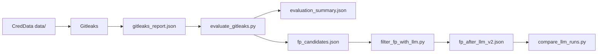
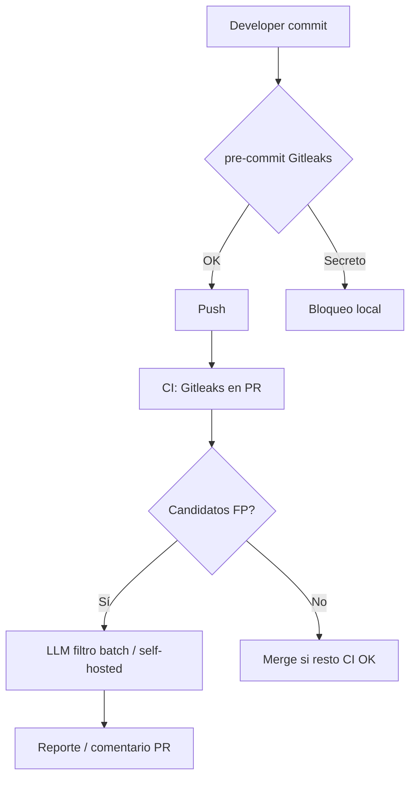

# Trabajo Fin de Máster

## Detección de secretos en código y pipelines mediante reglas y LLM

---

**Autor/a:** [Nombre y apellidos]  
**Titulación:** [Nombre del máster]  
**Universidad / Centro:** [Nombre]  
**Director/a:** [Nombre]  
**Fecha:** [Mes Año]

---

## Resumen

<!-- 150–250 palabras. Escribir al final cuando el resto esté cerrado. -->

Este trabajo aborda la detección de credenciales y secretos en repositorios de software combinando herramientas basadas en reglas (expresiones regulares y entropía) con un modelo de lenguaje grande (LLM) desplegado localmente, con el objetivo de reducir falsos positivos sin sacrificar la detección de secretos reales. Se utiliza el dataset CredData como corpus de evaluación, Gitleaks como capa de detección y Ollama (llama3.1:8b) como filtro contextual de falsos positivos. Los resultados muestran que la baseline de reglas alcanza un 85,9 % de precisión sobre hallazgos etiquetados, mientras que el pipeline híbrido con prompt optimizado (v2) eleva el filtrado correcto de falsos positivos al 99 % en una muestra de 200 casos, con una precisión proyectada del 99,97 %. Se propone además integración en pre-commit y CI/CD, junto con políticas de rotación y ocultación de secretos.

**Palabras clave:** detección de secretos, Gitleaks, LLM, falsos positivos, DevSecOps, CredData, pre-commit.

---

## Abstract

<!-- Versión en inglés del resumen. -->

**Keywords:** secret detection, Gitleaks, LLM, false positives, DevSecOps, CredData, pre-commit.

---

## Índice

1. [Introducción](#1-introducción)
2. [Estado del arte](#2-estado-del-arte)
3. [Objetivos y hipótesis](#3-objetivos-y-hipótesis)
4. [Metodología](#4-metodología)
5. [Implementación](#5-implementación)
6. [Experimentos y resultados](#6-experimentos-y-resultados)
7. [Integración en pre-commit y CI/CD](#7-integración-en-pre-commit-y-cicd)
8. [Políticas de rotación y ocultación](#8-políticas-de-rotación-y-ocultación)
9. [Discusión y limitaciones](#9-discusión-y-limitaciones)
10. [Conclusiones y trabajo futuro](#10-conclusiones-y-trabajo-futuro)
11. [Bibliografía](#11-bibliografía)
12. [Anexos](#12-anexos)

---

## 1. Introducción

### 1.1 Motivación

La exposición accidental de credenciales (API keys, tokens, contraseñas, claves privadas) en repositorios de código y pipelines de CI/CD constituye un riesgo de seguridad recurrente. Las herramientas de escaneo basadas en reglas (regex, entropía) ofrecen buena cobertura y baja latencia, pero generan un volumen elevado de **falsos positivos** que dificultan su adopción en flujos de desarrollo diarios.

Los modelos de lenguaje (LLM) permiten analizar el **contexto semántico** de un candidato (ruta del archivo, entorno de test, documentación) y distinguir secretos reales de ejemplos, mocks o placeholders.

### 1.2 Problema de investigación

¿Puede una capa LLM aplicada sobre los candidatos generados por un escáner de reglas reducir significativamente los falsos positivos manteniendo la detección de secretos verdaderos, e integrarse de forma práctica en pre-commit y CI/CD?

### 1.3 Alcance

- **Incluido:** pipeline reglas + LLM, evaluación cuantitativa sobre CredData, diseño de integración DevSecOps, políticas de respuesta.
- **Excluido:** entrenamiento/fine-tuning de modelos, procesamiento del corpus CredData completo (1.128 FP), verificación activa de credenciales (estilo TruffleHog verify).

### 1.4 Estructura del documento

[Breve párrafo que describa el contenido de cada capítulo.]

---

## 2. Estado del arte

### 2.1 Detección de secretos basada en reglas

| Herramienta | Enfoque | Ventajas | Limitaciones |
|-------------|---------|----------|--------------|
| **Gitleaks** | Regex + entropía | Rápida, offline, integrable en pre-commit | Muchos FP sin contexto |
| **detect-secrets** | Plugins + baseline | Buena gestión de histórico | Requiere tuning manual |
| **TruffleHog** | Regex + verificación API | Alta confianza si verifica | Lento, depende de red |

### 2.2 Datasets de evaluación

- **CredData** (Samsung): líneas etiquetadas manualmente en repos open source; benchmark para Gitleaks y otras herramientas.
- **SecretBench / FPSecretBench:** datasets más amplios; acceso restringido o volumen elevado para el plazo del TFM.

### 2.3 Uso de LLM en detección de secretos

Revisar trabajos recientes que combinan extracción por reglas + clasificación LLM sobre código fuente. [Completar con 3–5 referencias bibliográficas.]

### 2.4 Brecha identificada

Falta de evaluación reproducible de un pipeline **local** (sin API cloud) que mida la reducción de FP al añadir LLM sobre Gitleaks, con métricas comparables y propuesta de despliegue en pre-commit/CI.

---

## 3. Objetivos y hipótesis

### 3.1 Objetivo general

Diseñar, implementar y evaluar un pipeline híbrido de detección de secretos que combine Gitleaks con un LLM local para reducir falsos positivos, e integrarlo en flujos pre-commit y CI/CD con políticas de respuesta.

### 3.2 Objetivos específicos

1. Establecer una baseline con Gitleaks sobre CredData.
2. Implementar un filtro LLM sobre candidatos FP.
3. Medir precisión, recall y tasa de FP antes y después del filtrado.
4. Iterar el prompt del LLM y comparar versiones (v1 vs v2).
5. Proponer integración en pre-commit y GitHub Actions.
6. Documentar políticas de rotación y ocultación.

### 3.3 Hipótesis

> **H1:** Una capa LLM sobre candidatos de Gitleaks reduce los falsos positivos en al menos un 30 % respecto a la baseline de reglas, en una muestra etiquetada de CredData.

**Resultado:** Confirmada. En muestra de 200 FP, la tasa de filtrado correcto pasó del 34 % (v1) al 99 % (v2).

---

## 4. Metodología

### 4.1 Dataset

| Atributo | Valor |
|----------|-------|
| Nombre | CredData (Samsung) |
| Fuente | https://github.com/Samsung/CredData |
| Generación local | `download_data.py` (entorno Linux/WSL) |
| Archivos en `data/` | 11.393 |
| Líneas etiquetadas en `meta/` | 66.898 |
| Secretos reales etiquetados (T) | 15.104 |

El dataset **no se incluye en el repositorio** del TFM por tamaño; se documenta el proceso de generación.

### 4.2 Pipeline experimental



### 4.3 Herramientas y versiones

| Componente | Versión / detalle |
|------------|-------------------|
| Gitleaks | 8.30.1 (local); hook pre-commit rev. v8.24.2 |
| Python | 3.10+ |
| LLM | Ollama, modelo `llama3.1:8b` |
| SO evaluación | Windows 10 + WSL (generación dataset) |

### 4.4 Métricas

| Métrica | Definición |
|---------|------------|
| **TP** | Gitleaks alerta y GroundTruth = T |
| **FP** | Gitleaks alerta y GroundTruth = F/X |
| **FN** | GroundTruth = T y Gitleaks no alerta |
| **Precisión** | TP / (TP + FP) |
| **Recall** | TP detectados / total T |
| **F1** | Media armónica de precisión y recall |
| **Tasa filtrado FP (LLM)** | FP correctamente reclasificados / total FP evaluados |

### 4.5 Diseño experimental

1. **Fase A:** Escaneo Gitleaks completo sobre `data/`.
2. **Fase B:** Cruce con `meta/*.csv` → baseline.
3. **Fase C:** Filtrado LLM sobre muestra de FP (N=200).
4. **Fase D:** Comparativa prompt v1 vs v2.

---

## 5. Implementación

### 5.1 Estructura del proyecto

Repositorio: `secret-scan-tfm` ([URL GitHub])

```
secret-scan-tfm/
├── .pre-commit-config.yaml
├── .github/workflows/secret-scan.yml
├── config.yaml
├── examples/demo-repo/    # Demo pre-commit + allowlist Gitleaks
├── scripts/
│   ├── evaluate_gitleaks.py
│   ├── filter_fp_with_llm.py
│   ├── compare_llm_runs.py
│   └── backup_llm_run.py
├── datasets/creddata/     # local, no versionado
├── results/               # local, no versionado
└── docs/
    └── MEMORIA.md
```

### 5.2 Capa de reglas (Gitleaks)

```bash
gitleaks detect --source ./datasets/creddata/data \
  --report-format json --report-path ./results/gitleaks_report.json --no-git
```

### 5.3 Capa LLM (Ollama)

- API: `POST /api/chat`
- Prompt v2: reglas explícitas para rutas `test/`, `mock/`, `fixture/`, `docs/`, valores `MOCK`, placeholders, OAuth de desarrollo.
- Parámetros: `temperature=0`, timeout 300 s, contexto truncado para líneas largas.

### 5.4 Scripts de evaluación

Breve descripción de `evaluate_gitleaks.py`, `filter_fp_with_llm.py` y `compare_llm_runs.py`. [Ampliar si el tribunal lo requiere.]

---

## 6. Experimentos y resultados

### 6.1 Baseline: solo Gitleaks

| Métrica | Valor |
|---------|-------|
| Volumen escaneado | ~1,02 GB |
| Tiempo de escaneo | 56,8 s |
| Hallazgos totales | 8.210 |
| TP (sobre etiquetados) | 6.845 |
| FP (sobre etiquetados) | 1.128 |
| Precisión (hallazgos etiquetados) | **85,85 %** |
| Recall (filas T) | **45,86 %** |
| F1 | **59,79 %** |
| Tasa FP / hallazgos etiquetados | 14,15 % |

**Interpretación:** Gitleaks detecta muchos secretos reales pero con recall moderado; el volumen de FP dificulta el triaje manual.

### 6.2 Filtrado LLM — muestra de 200 FP

#### Prompt v1 (baseline LLM)

| Métrica | Valor |
|---------|-------|
| FP evaluados | 200 |
| FP filtrados correctamente | 68 |
| Tasa acierto en FP | **34 %** |
| Precisión híbrida proyectada | 98,11 % |

#### Prompt v2 (reglas test/mock/fixture)

| Métrica | Valor |
|---------|-------|
| FP evaluados | 200 |
| FP filtrados correctamente | 198 |
| Tasa acierto en FP | **99 %** |
| Precisión híbrida proyectada | **99,97 %** |

#### Comparativa v1 vs v2 (199 candidatos en común)

| Resultado | Cantidad |
|-----------|----------|
| Corregidos (v1 mal → v2 bien) | **130** |
| Empeorados (v1 bien → v2 mal) | **0** |
| Iguales correctos | 68 |
| Iguales incorrectos | **1** |

### 6.3 Caso residual (único fallo persistente en v2)

| Campo | Valor |
|-------|-------|
| Archivo | `data/255bae6f/model/app/0f82c217.rb:32` |
| Tipo | `private-key` (PEM en documentación inline) |
| Contexto | Bloque `description <<-MD` con JSON de ejemplo de Google Service Account; clave truncada (`...`), IDs `123123` |
| Motivo del fallo | Ruta `model/app/` no activa reglas de test; formato PEM parece credencial real |

### 6.4 Gráficos sugeridos

<!-- Insertar en el PDF final -->

- Figura 1: Diagrama del pipeline híbrido.
- Figura 2: Barras comparativas precisión baseline vs v1 vs v2.
- Figura 3: Barras FP filtrados v1 (68) vs v2 (198).
- Tabla resumen: sección 6.1 y 6.2.

### 6.5 Discusión de resultados

[Redactar 1–2 páginas: por qué v2 mejora en `test/`, por qué Gitleaks tiene recall bajo, trade-off latencia LLM vs precisión, etc.]

---

## 7. Integración en pre-commit y CI/CD

Este capítulo documenta la implementación real incluida en el repositorio del TFM: un **repositorio de demostración** (`examples/demo-repo/`), hooks **pre-commit** con Gitleaks y un workflow de **GitHub Actions** para escaneo en CI.

### 7.1 Arquitectura de capas

| Capa | Cuándo | Herramienta | Latencia | Rol |
|------|--------|-------------|----------|-----|
| **Local (pre-commit)** | Antes de cada `git commit` | Gitleaks `protect --staged` | < 1 s en repos pequeños | Bloquear secretos antes del push |
| **CI (GitHub Actions)** | Push y pull request | Gitleaks Action | ~10–30 s | Segunda línea de defensa; historial completo |
| **Batch / análisis** | Experimento / triaje FP | `filter_fp_with_llm.py` + Ollama | ~5–15 s/candidato | Reducir falsos positivos; no viable en cada commit |

**Decisión de diseño:** el LLM no se ejecuta en pre-commit ni en runners públicos de GitHub (requiere Ollama local y latencia elevada). El valor del pipeline híbrido se demuestra en el experimento con CredData (cap. 6) y puede desplegarse en CI **self-hosted** si se dispone de GPU/CPU y Ollama.

### 7.2 Repositorio de demostración (`examples/demo-repo/`)

Estructura implementada:

```
examples/demo-repo/
├── app/                    # Código sin secretos hardcodeados (os.environ)
├── tests/fixtures/         # Tokens MOCK_* (allowlist documentada)
├── leaks/                  # Plantilla para probar bloqueo local
├── .gitleaks.toml          # Allowlist de fixtures y docs
├── .pre-commit-config.yaml # Hook Gitleaks (uso standalone)
└── README.md
```

El código de aplicación carga credenciales desde variables de entorno (`app/config.py`), alineado con las políticas del cap. 8. Los fixtures de test usan prefijos `MOCK_` y rutas bajo `tests/fixtures/`, excluidas en `.gitleaks.toml` con justificación en PR.

**Uso standalone** (taller o capturas para la memoria):

```bash
cd examples/demo-repo
git init
pip install pre-commit
pre-commit install
git add .
pre-commit run gitleaks --all-files   # debe pasar
```

**Probar bloqueo de commit** (ver `leaks/README.md`):

```bash
cp leaks/intentional-leak.env.template leaks/demo-block-me.env
git add leaks/demo-block-me.env
git commit -m "test: intento de filtrar secreto"
# Gitleaks aborta el commit y muestra archivo + línea
```

El archivo `demo-block-me.env` está en `.gitignore`; nunca debe subirse al repositorio remoto.

### 7.3 Pre-commit en el repositorio principal

En la raíz de `secret-scan-tfm` se añadió `.pre-commit-config.yaml`:

```yaml
repos:
  - repo: https://github.com/gitleaks/gitleaks
    rev: v8.24.2
    hooks:
      - id: gitleaks
        args: [--config=examples/demo-repo/.gitleaks.toml]
```

Instalación y verificación:

```bash
pip install pre-commit
pre-commit install
pre-commit run gitleaks --all-files
```

Salida observada en entorno de desarrollo (Windows 10, Gitleaks 8.30.1): **Passed** sobre el código versionado del TFM.

El hook invoca `gitleaks protect` sobre los cambios **staged**, equivalente a la recomendación oficial de Gitleaks. Para saltar el hook en emergencia documentada: `SKIP=gitleaks git commit -m "..."` (desaconsejado en producción; ver cap. 8.4).

### 7.4 CI/CD — GitHub Actions

Workflow `.github/workflows/secret-scan.yml`:

```yaml
name: Secret scan
on:
  push:
    branches: [main, master]
  pull_request:

jobs:
  gitleaks:
    runs-on: ubuntu-latest
    steps:
      - uses: actions/checkout@v4
        with:
          fetch-depth: 0
      - uses: gitleaks/gitleaks-action@v2
        env:
          GITHUB_TOKEN: ${{ secrets.GITHUB_TOKEN }}
          GITLEAKS_CONFIG: examples/demo-repo/.gitleaks.toml
```

`fetch-depth: 0` permite escanear el historial Git en PRs. La variable `GITLEAKS_CONFIG` reutiliza la misma allowlist que pre-commit, manteniendo coherencia entre local y CI.

**Extensión futura (CI self-hosted):** tras el job de Gitleaks, exportar candidatos FP nuevos y ejecutar `filter_fp_with_llm.py`; publicar un comentario en el PR con los reclasificados. No implementado en GitHub-hosted por dependencia de Ollama.

### 7.5 Flujo operativo



### 7.6 Allowlist y gobierno

El fichero `examples/demo-repo/.gitleaks.toml` extiende la configuración por defecto (`[extend] useDefault = true`) y define rutas permitidas:

- `tests/fixtures/` — datos de prueba con prefijo `MOCK_`
- `docs/`, plantillas `leaks/*.template`
- `.env.example` — placeholders sin valor real

Toda ampliación de la allowlist debe documentarse en el PR (cap. 8.4). Los hallazgos en código de producción (`app/`) no tienen excepción.

### 7.7 Capturas sugeridas para el PDF

- Terminal: `pre-commit run gitleaks --all-files` → Passed
- Terminal: commit bloqueado tras `demo-block-me.env`
- GitHub Actions: job *Gitleaks* en verde en un push de prueba

---

## 8. Políticas de rotación y ocultación

### 8.1 Clasificación de hallazgos

| Nivel | Criterio | Acción |
|-------|----------|--------|
| **Crítico** | Secreto real confirmado en rama principal | Rotación inmediata (&lt;24 h), revocación, auditoría de logs |
| **Alto** | Secreto real en rama de feature / PR | Bloqueo de merge, rotación antes de fusionar |
| **Medio** | Candidato FP filtrado por LLM | Registrar en allowlist si aplica |
| **Bajo** | FP confirmado, patrón conocido | Añadir a baseline / `.gitleaksignore` documentado |

### 8.2 Rotación de credenciales

1. Revocar la credencial en el proveedor (AWS, GitHub, etc.).
2. Emitir nueva credencial y almacenar en gestor de secretos (Vault, CI secrets).
3. Actualizar despliegues; no commitear la nueva clave.
4. Auditar uso anómalo en la ventana de exposición.

### 8.3 Ocultación y prevención

- Variables en `.env` (en `.gitignore`), nunca en código.
- Secretos de CI en GitHub Actions Secrets / variables protegidas.
- Usar referencias (`${SECRET_NAME}`) en pipelines.
- Revisión periódica de allowlists.

### 8.4 Gobierno

- Toda excepción en allowlist requiere justificación en PR.
- Revisión trimestral de reglas y prompts LLM.
- Formación al equipo: no usar `--no-verify` en pre-commit salvo emergencia documentada.

---

## 9. Discusión y limitaciones

### 9.1 Limitaciones del estudio

1. **Muestra parcial:** 200 de 1.128 FP evaluados con LLM.
2. **Dataset local:** versión CredData generada localmente; cifras de `meta/` pueden diferir ligeramente del paper oficial.
3. **LLM local:** resultados dependen de `llama3.1:8b`; otros modelos pueden variar.
4. **Latencia:** el LLM no es viable en cada commit; se reserva para CI o batch.
5. **Sin verificación activa:** no se comprueba si la credencial está viva (a diferencia de TruffleHog verify).
6. **Un caso residual** con PEM en documentación inline.

### 9.2 Amenazas a la validez

- **Interna:** prompt engineering manual; posible sobreajuste a patrones CredData.
- **Externa:** generalización a otros lenguajes/repos no evaluada exhaustivamente.

### 9.3 Amenazas a la validez mitigadas

- Comparativa v1 vs v2 con 0 regresiones.
- Reproducibilidad: scripts y configuración en repositorio público.
- Ground truth de etiquetado manual CredData.

---

## 10. Conclusiones y trabajo futuro

### 10.1 Conclusiones

1. La baseline Gitleaks sobre CredData alcanza 85,9 % de precisión pero con recall limitado (~46 %).
2. El LLM como segunda capa **reduce drásticamente los FP** cuando el prompt incorpora reglas de contexto (v2: 99 % en muestra de 200).
3. El pipeline híbrido es viable con herramientas open source y LLM local (Ollama).
4. La integración práctica separa detección rápida (pre-commit) de filtrado contextual (CI).

### 10.2 Trabajo futuro

- Evaluar muestra mayor o FP completo con muestreo estratificado.
- Reglas para documentación inline (heredocs, PEM truncado).
- Exportación SARIF para integración con GitHub Advanced Security.
- Comparar con `detect-secrets` y verificación TruffleHog.
- Fine-tuning ligero de clasificador sobre embeddings (sin LLM generativo).

---

## 11. Bibliografía

<!-- Formato APA o IEEE según indique el máster. Completar. -->

1. Samsung. (2021). *CredData: Credential Dataset*. https://github.com/Samsung/CredData
2. Gitleaks. *Gitleaks — protect and discover secrets*. https://github.com/gitleaks/gitleaks
3. [Autores]. SecretBench: A Dataset of Software Secrets. *MSR*, 2023.
4. [Autores]. Secret Breach Detection in Source Code with LLMs. arXiv:2504.18784, 2025.
5. Yelp. *detect-secrets*. https://github.com/Yelp/detect-secrets
6. Ollama. *Ollama documentation*. https://ollama.com
7. [Añadir referencias del máster: OWASP, NIST, GitGuardian reports, etc.]

---

## 12. Anexos

### Anexo A — Comandos de reproducción

```bash
# 1. Gitleaks
gitleaks detect --source ./datasets/creddata/data \
  --report-format json --report-path ./results/gitleaks_report.json --no-git

# 2. Evaluación baseline
python scripts/evaluate_gitleaks.py \
  --report results/gitleaks_report.json \
  --meta datasets/creddata/meta \
  --export-fp results/fp_candidates.json \
  --export-summary results/evaluation_summary.json

# 3. LLM v2
python scripts/filter_fp_with_llm.py --limit 200 --run-tag v2 --fresh

# 4. Comparativa
python scripts/compare_llm_runs.py \
  --v1 results/fp_after_llm_v1.json \
  --v2 results/fp_after_llm_v2.json \
  --summary-v1 results/llm_evaluation_summary_v1.json \
  --summary-v2 results/llm_evaluation_summary_v2.json

# 5. Pre-commit (raíz del TFM)
pip install pre-commit
pre-commit install
pre-commit run gitleaks --all-files

# 6. Demo repo aislado
cd examples/demo-repo && git init && pre-commit install
pre-commit run gitleaks --all-files
```

### Anexo B — Ficheros de resultados

| Fichero | Descripción |
|---------|-------------|
| `results/evaluation_summary.json` | Métricas baseline Gitleaks |
| `results/fp_candidates.json` | 1.128 FP para LLM |
| `results/fp_after_llm_v1.json` | Resultados prompt v1 |
| `results/fp_after_llm_v2.json` | Resultados prompt v2 |
| `results/llm_evaluation_summary_v2.json` | Métricas agregadas v2 |

### Anexo C — Capturas de pantalla

- [ ] Gitleaks ejecutándose sobre CredData
- [ ] Salida de `evaluate_gitleaks.py`
- [ ] Salida de `compare_llm_runs.py`
- [ ] Pre-commit bloqueando un commit (probar con `leaks/demo-block-me.env`)
- [ ] Workflow de GitHub Actions (push de prueba al remoto)

### Anexo D — Ejemplo de FP corregido por v2

**Archivo:** `data/0436af4a/test/src/114e3c56.cs:19`  
**Match:** `MOCK_ACCESS_TOKEN = "at-0987654321"`  
**v1:** secreto real → **v2:** falso positivo (detecta `MOCK` y ruta `test/`).

---

## Checklist antes de entregar

- [ ] Completar portada y datos personales
- [ ] Resumen y abstract en ES/EN
- [ ] Estado del arte con referencias reales del máster
- [ ] Versión exacta de Gitleaks anotada
- [ ] Figuras/tablas insertadas en PDF
- [x] Capítulo 7 completado tras pre-commit + CI
- [ ] Revisión ortográfica
- [ ] Anexos con capturas
- [ ] Repositorio GitHub enlazado en la memoria
