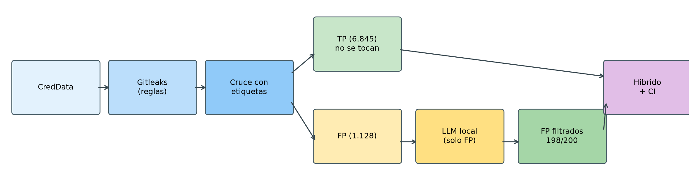
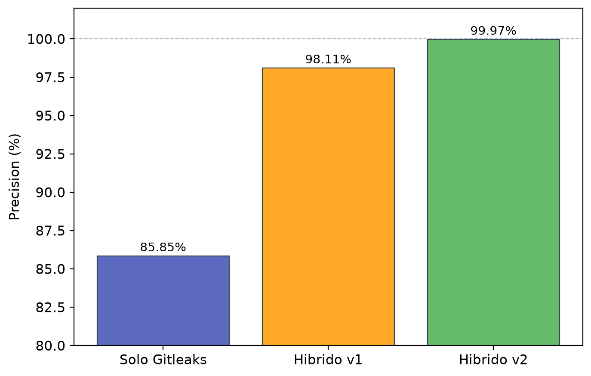
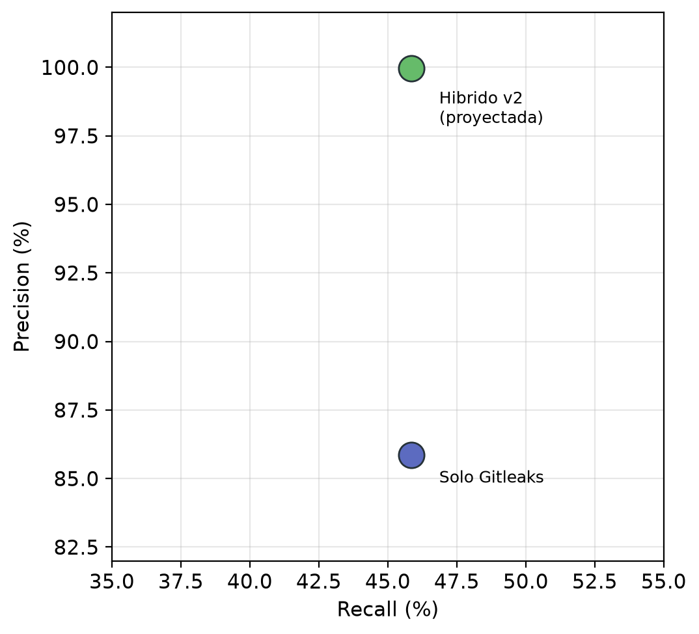

# Portada — Trabajo Fin de Máster

**UNIVERSIDAD CATÓLICA DE MURCIA (UCAM)**

**2ª Ed. Máster en IA Aplicada a la Ciberseguridad**

*Curso académico: 14/10/2025 – 31/08/2026*

# Detección de secretos en código y pipelines mediante reglas y LLM

### Combinación de expresiones regulares y entropía con un modelo de lenguaje para reducir falsos positivos, integración en pre-commit y CI/CD, medición de resultados y políticas de rotación y ocultación

**Trabajo Fin de Máster**

**Autor/a:** Ángela Ramírez Barajas

**Director:** Juanjo Salvador

Murcia, julio 2026

\newpage

## Resumen

Las herramientas de detección de secretos basadas en reglas (expresiones regulares y entropía) son rápidas e integrables en Git, pero generan muchos falsos positivos: un token de test o un ejemplo en documentación dispara la misma alerta que una credencial de producción. Este trabajo propone un pipeline híbrido en el que Gitleaks detecta candidatos y un LLM local (Llama 3.1 8B, vía Ollama) reclasifica *solo* los falsos positivos, sin alterar los verdaderos positivos. Sobre CredData, Gitleaks obtiene 85,85 % de precisión y 45,86 % de recall. Con un prompt contextual, el LLM descarta correctamente el 99 % de una muestra de 200 falsos positivos (34 % con un prompt genérico), elevando la precisión híbrida proyectada al 99,97 % sin cambiar el recall. El escáner de reglas se integra en pre-commit y CI/CD; el LLM queda para triaje en lote. No se pretende superar en F1 global a sistemas con fine-tuning: el aporte es operativo, medible y sin reentrenamiento.

**Palabras clave:** detección de secretos, Gitleaks, LLM, falsos positivos, DevSecOps, CredData.

## 1. Introducción

El enunciado de este TFM pide combinar reglas (expresiones regulares y entropía) con un modelo de lenguaje para reducir falsos positivos al buscar claves y tokens en repositorios, integrar esa detección en pre-commit y CI/CD, medir resultados y proponer políticas de rotación y ocultación.

Esa formulación responde a un problema concreto de adopción. Gitleaks, detect-secrets o TruffleHog identifican formatos conocidos (claves AWS, JWT, PEM, cadenas de alta entropía) en milisegundos y se enganchan a un hook de Git. El coste no es la latencia, sino el ruido: la misma regla que encuentra un secreto real dispara también sobre `MOCK_ACCESS_TOKEN` en un fixture, un PEM de ejemplo en un README o un placeholder en `.env.example`. En pre-commit, ese ruido se traduce en commits bloqueados sin motivo; en CI, en alertas que el equipo aprende a ignorar.

Los trabajos recientes con LLM muestran que el contexto semántico —ruta, nombre de variable, entorno— discrimina mejor que el formato del valor (Rahman et al., 2025; Biringa y Kul, 2025). La mayoría, sin embargo, entrenan o ajustan un clasificador para maximizar el F1 global: el modelo decide, sobre cada candidato, si hay secreto. Ese no es el problema que aquí se aborda. Gitleaks ya detecta; lo que frena su uso es el volumen de falsos positivos. La pregunta de este trabajo es más estrecha:

> ¿Puede un LLM local, sin fine-tuning, recortar los falsos positivos de un escáner de reglas *sin tocar los verdaderos positivos*, y encajar esa separación en un flujo DevSecOps real?

La respuesta se articula en tres decisiones de diseño, que son el núcleo de la propuesta:

1. **El LLM no busca secretos.** Recibe hallazgos que Gitleaks ya produjo. Las reglas cubren detección y recall; el modelo cubre triaje.
2. **Solo se evalúa (y se filtra) la rama de falsos positivos.** Los verdaderos positivos no pasan por el modelo, de modo que un error del LLM no puede silenciar un secreto real. Por eso el recall del híbrido es exactamente el de Gitleaks, y por eso no se reporta un F1 «del LLM» como si fuera un detector.
3. **La comparación justa no es «LLM frente a heurísticas» en abstracto, sino «reglas solas frente a reglas más filtro»**, y, frente a papers con LoRA, un posicionamiento honesto: no se reclama mejor F1 de laboratorio, sino precisión operativa sin entrenamiento ni API cloud.

Quedan fuera de alcance el fine-tuning, el procesamiento de los 1.128 falsos positivos de CredData (se usa una muestra de 200) y la verificación activa de credenciales contra APIs (estilo TruffleHog). El resto del documento sigue ese hilo: qué hay en la literatura, cómo funciona el pipeline, qué se midió y cómo se opera.

## 2. Contexto y trabajos relacionados

Los escáneres de reglas combinan patrones (regex para formatos conocidos) y umbrales de entropía (Meli et al., 2019). Gitleaks es representativo: rápido, offline e integrable en pre-commit y GitHub Actions, con el inconveniente de tratar cada coincidencia de forma aislada (Zanev, 2024). En el benchmark oficial de CredData (Samsung, abril 2022) obtuvo 52,6 % de precisión y 24,4 % de recall (Yun et al., 2021); cifras posteriores con versiones más recientes, como las de este trabajo, mejoran la precisión pero no resuelven el ruido. detect-secrets añade una *baseline* de falsos positivos conocidos, a costa de mantenimiento manual (Yelp, 2024). TruffleHog verifica si la credencial sigue viva; es más fiable cuando hay red, y éticamente delicado sobre secretos ajenos (Truffle Security, 2024). OWASP recomienda *shift-left* (hook local más CI) y gestores de secretos, no sustituir la detección por más reglas (OWASP, 2024a, 2024b).

La evaluación rigurosa exige ground truth. CredData (Yun et al., 2021) etiqueta líneas de repositorios públicos como secreto real (T), falso positivo (F) o no aplicable (X). SecretBench es mayor y está en BigQuery (Basak et al., 2023); aquí se usa CredData por ser reproducible en local y porque incluye Gitleaks en su comparativa oficial.

Sobre esa base hay tres líneas de aprendizaje automático. CredSweeper entrena un modelo clásico y obtiene el mejor F1 oficial en CredData (0,859), con el coste de mantener el modelo (Samsung, 2022). Biringa y Kul (2025) usan embeddings BERT/GPT-2 y un clasificador sobre CredData (F1 0,973). Rahman et al. (2025) extraen candidatos por regex y clasifican con LLM sobre SecretBench; con Llama 3.1 8B ajustado (LoRA) llegan a F1 0,985. Es el trabajo más cercano, y también el más fácil de malinterpretar: **clasifican candidatos para maximizar F1; este TFM filtra falsos positivos de Gitleaks para maximizar precisión operativa sin bajar el recall de las reglas.**

| Aspecto | Reglas (Gitleaks) | Rahman et al. (2025) | Este trabajo |
|---------|-------------------|----------------------|--------------|
| Rol del modelo | No hay | Detector/clasificador | Filtro de FP |
| Entrenamiento | No | LoRA sobre SecretBench | Ninguno (prompt) |
| Métrica principal | Precisión / recall del escáner | F1 global | Tasa de FP descartados y precisión híbrida |
| Recall de las reglas | El del escáner | No aplica (otro pipeline) | Se conserva a propósito |
| Integración | Pre-commit / CI | Propuesta | Pre-commit y CI con reglas; LLM en lote |

La brecha no es «usar un LLM para secretos», ya demostrado. Es cuantificar cuánto aporta un filtro contextual, sin fine-tuning, sobre un escáner que un equipo puede desplegar mañana.

## 3. Solución propuesta

### 3.1 Cómo funciona el pipeline

El flujo tiene dos capas con responsabilidades distintas (Figura 1).

**Capa 1 — detección (Gitleaks).** Se escanea el corpus CredData (~1,02 GB, 11.393 archivos) con las reglas por defecto (regex + entropía). Cada hallazgo es un candidato: archivo, línea, regla y fragmento coincidente. Esta capa es la única que *encuentra* secretos. Lo que no dispara Gitleaks no llega nunca al LLM: de ahí que el recall no pueda subir.

**Capa 2 — cruce con ground truth.** Cada hallazgo se alinea con las etiquetas de CredData. Tres conjuntos:

- **Verdadero positivo (TP):** alerta y etiqueta T. En este experimento, 6.845. No se envían al LLM.
- **Falso positivo (FP):** alerta y etiqueta F o X. En este experimento, 1.128. Son la entrada del filtro.
- **Sin etiqueta / no detectado:** hallazgos fuera de `meta/` y secretos T que Gitleaks no vio (8.177 FN). El LLM no actúa sobre los FN.

**Capa 3 — filtro LLM (solo FP).** Para cada candidato de la muestra se construye un mensaje con la ruta, la regla, el fragmento y un recorte del código alrededor. El modelo (`llama3.1:8b`, temperatura 0) responde si el hallazgo es un secreto real o un falso positivo. Si declara falso positivo, la alerta se descarta para el cálculo de precisión híbrida; si declara secreto real, se mantiene (el filtro ha fallado en ese caso).

**Precisión híbrida.** Se proyecta como TP / (TP + FP restantes), asumiendo que los TP no se tocan y que la tasa de acierto de la muestra se sostiene sobre el resto de FP. Es una cota optimista; se discute en el apartado 4.

{width=95%}

**Figura 1.** Pipeline híbrido. Las reglas detectan; el LLM solo reclasifica falsos positivos.

### 3.2 Por qué solo se evalúan falsos positivos

No es una omisión experimental: es la hipótesis operativa.

Si el LLM viera también los TP, un único «esto es un mock» sobre un secreto real bajaría el recall. El enunciado pide *reducir falsos positivos*, no sustituir el detector. Medir al modelo como clasificador binario de todas las líneas (como Rahman et al.) respondería a «¿el LLM detecta secretos?». Aquí la pregunta es «¿el filtro reduce ruido de un escáner ya usable?». Por eso las métricas del modelo son la tasa de FP correctamente descartados y la precisión híbrida, y por eso el recall se reporta —sin maquillaje— como el de Gitleaks: 45,86 %.

Una consecuencia práctica: el LLM no es viable en cada `git commit` (~5–15 s por candidato). Gitleaks en pre-commit tarda menos de un segundo. El híbrido se despliega en dos tiempos: bloqueo rápido con reglas; triaje contextual en lote o en un runner con Ollama.

### 3.3 Dos prompts, el mismo modelo

Se comparan dos versiones sobre los mismos 200 FP, con el mismo modelo y temperatura 0, para aislar el efecto del prompt.

- **v1 (genérico):** «decide si es secreto real o falso positivo». El modelo se fía del formato: un PEM o un token con pinta de clave tiende a clasificarse como auténtico aunque viva en `tests/`.
- **v2 (contextual):** reglas explícitas. Rutas `/test/`, `/fixtures/`, `/docs/`, `/mock/`; nombres `MOCK`, `placeholder`, `example`; valores de desarrollo (`localhost`, secuencias tipo `at-0987654321`); y la instrucción de que un formato creíble *no basta* si el contexto es de prueba. El modelo debe marcar secreto real solo si parece credencial de runtime sin señales de test o documentación.

La hipótesis H1 era una reducción de FP de al menos el 30 % en la muestra. El resultado (apartado 4) la confirma con holgura, y muestra que la ganancia viene del prompt, no de cambiar de modelo.

### 3.4 Integración y políticas

En el flujo de desarrollo, Gitleaks se ejecuta antes de cada commit y de nuevo en cada push y pull request (GitHub Actions, historial Git completo). Los secretos de pipeline no van en el YAML: se referencian como secretos del proveedor (`secrets.API_TOKEN`). El LLM no corre en runners públicos de GitHub.

Si hay un hallazgo confirmado: rotar en menos de 24 h si está en la rama principal; bloquear el merge si está en un PR; no ampliar la lista de excepciones sin justificación. Ocultación: variables de entorno, almacén (Vault / secretos de CI), nunca hardcodear. Un secreto en un workflow se trata igual que en código de aplicación.

## 4. Experimentos y resultados

**Dataset.** CredData generado en local: 66.898 líneas etiquetadas, 15.104 secretos reales (T). Gitleaks 8.30.1; LLM Llama 3.1 8B en Ollama.

**Baseline (solo Gitleaks).** 8.210 hallazgos en 56,8 s. Sobre líneas etiquetadas: 6.845 TP, 1.128 FP, precisión 85,85 %, recall 45,86 %, F1 59,79 %. La herramienta es útil como primera red: la mayoría de alertas etiquetadas son secretos reales. El recall moderado se explica por formatos que las reglas por defecto no cubren (credenciales en URL, nonces, secretos propietarios). El híbrido no pretende cerrar esos FN. El problema que sí ataca son 1.128 FP: un volumen de triaje inviable en un hook diario.

**Filtro LLM (N = 200 FP).** Con v1, 68 descartes correctos (34 %) y precisión híbrida proyectada 98,11 %. Con v2, 198/200 (99 %) y 99,97 % proyectada. Sobre 199 candidatos comunes: 130 correcciones v1→v2, **cero empeoramientos**, 68 iguales correctos y 1 igual incorrecto. El único fallo persistente es un PEM de ejemplo embebido en documentación *inline* dentro de una ruta de aplicación (`model/app/`), sin segmentos `/test/`: el formato PEM gana a señales débiles (IDs `123123`, clave truncada). Es el límite del filtrado por ruta.

La Figura 2 muestra el salto de precisión; la Figura 3, que el recall no se mueve: el híbrido sube en el eje de precisión y permanece en el mismo recall que Gitleaks. Esa es la evidencia de que el LLM no es un detector adicional, sino un filtro.

{width=72%}

**Figura 2.** Precisión: reglas solas frente a reglas + LLM (v1 genérico, v2 contextual). El valor de v2 es una proyección a partir de la muestra de 200 FP.

{width=58%}

**Figura 3.** Precisión frente a recall. El punto híbrido está sobre el mismo recall (45,86 %); solo cambia la precisión.

**¿Mejora a otras propuestas LLM y a las heurísticas?** Frente a Gitleaks, sí en la métrica que importa para adopción: menos ruido, mismos TP. Frente a Rahman et al. o Biringa y Kul, **no se reclama un F1 superior**. Ellos entrenan para clasificación global en otro (o el mismo) corpus; aquí no hay entrenamiento y la tarea es más estrecha. Lo que sí se muestra, y no aparece en esos papers, es que un prompt con reglas de contexto basta para pasar del 34 % al 99 % de acierto en FP de Gitleaks, con el mismo 8B, y que esa ganancia se puede operar: reglas en el commit, LLM fuera de la ruta crítica.

La proyección 99,97 % asume que los 928 FP no muestreados se comportan como los 200 evaluados. Es una cota alta. Los FP de CredData se concentran en tests, mocks y documentación —justo lo que v2 codifica—, pero un muestreo estratificado o el corpus completo podría bajar el porcentaje. H1, en la muestra, queda confirmada (99 % frente al umbral del 30 %).

## 5. Limitaciones y conclusiones

La muestra es el 17,7 % de los FP; el LLM es un único modelo local; no hay verificación de si la credencial está viva; el recall de las reglas no mejora. El prompt v2 puede estar sobreajustado a patrones de CredData. Aun así, la comparativa v1/v2 con cero regresiones, el ground truth manual y un pipeline reproducible sostienen la conclusión principal.

El detector usable en el día a día sigue siendo el de reglas. El LLM aporta discriminación semántica donde esas reglas son ciegas al contexto, siempre que no se le pida detectar lo que Gitleaks no vio y siempre que el prompt deje de ser un «¿parece un secreto?» genérico. Sin fine-tuning ni servicios cloud, el híbrido reduce de forma medible el ruido que impide adoptar el escáner, se integra en pre-commit y CI, y se acompaña de una política simple: rotar lo real, no negociar excepciones opacas, no escribir secretos en el YAML del pipeline.

Trabajo futuro: evaluar los 1.128 FP o una muestra estratificada; reglas para documentación *inline* (el caso PEM); comparar con detect-secrets y con verificación activa; y, si hubiera GPU, un clasificador ligero al estilo de la literatura, midiendo no solo F1 sino latencia en CI.

## Bibliografía

Basak, S. K., Neil, L., Reaves, B., y Williams, L. (2023). SecretBench: A dataset of software secrets. En *Proceedings of the 20th International Conference on Mining Software Repositories (MSR)* (pp. 347-351). IEEE. https://doi.org/10.1109/MSR59073.2023.00053

Biringa, C., y Kul, G. (2025). Detecting hard-coded credentials in software repositories via LLMs. *arXiv preprint* arXiv:2506.13090. https://arxiv.org/abs/2506.13090

Meli, M., McNee, J., y Neville-Neil, G. (2019). Source code credentials hygiene: A case study. En *Proceedings of the 44th IEEE/IFIP International Conference on Dependable Systems and Networks Workshops (DSN-W)*. IEEE.

OWASP Foundation. (2024a). CI/CD security cheat sheet. https://cheatsheetseries.owasp.org/cheatsheets/CI_CD_Security_Cheat_Sheet.html

OWASP Foundation. (2024b). Secrets management cheat sheet. https://cheatsheetseries.owasp.org/cheatsheets/Secrets_Management_Cheat_Sheet.html

Rahman, M. N., Ahmed, S. I., Wahab, Z., Sohan, S. M., y Shahriyar, R. (2025). Secret breach detection in source code with large language models. *arXiv preprint* arXiv:2504.18784. https://arxiv.org/abs/2504.18784

Samsung. (2022). CredSweeper: ML-driven credential scanner. https://github.com/Samsung/CredSweeper

Truffle Security. (2024). TruffleHog: Find and verify leaked credentials. https://github.com/trufflesecurity/trufflehog

Yelp. (2024). detect-secrets: Tool for detecting secrets in the codebase. https://github.com/Yelp/detect-secrets

Yun, J., Choi, S., Lee, Y., Sokol, O., Shim, W., Melkonyan, A., y Kuzmenko, D. (2021). CredData: A dataset of credentials for research. Samsung. https://github.com/Samsung/CredData

Zanev, Z. (2024). Gitleaks. https://github.com/gitleaks/gitleaks
